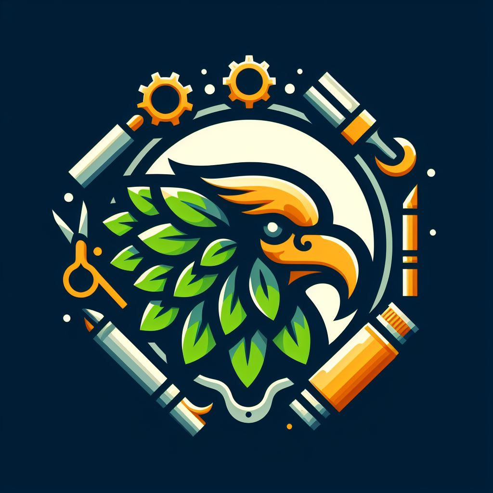

## MakeLogoAI: Crafting Professional Logos with AI Precision

### Summary
MakeLogoAI, accessible at [makelogo.ai](https://makelogo.ai), introduces an innovative platform that utilizes AI to streamline logo design. This article explores how MakeLogoAI leverages advanced AI algorithms to empower users in creating professional logos efficiently and effectively.



### Key Points

1. **Introduction to MakeLogoAI:** Highlighting [makelogo.ai](https://makelogo.ai)'s role in simplifying logo design through AI-driven innovations.
2. **AI's Role in Logo Creation:** Exploring how MakeLogoAI employs AI to facilitate logo design processes with precision and creativity.
3. **Pros and Cons** (Table Format):

| Pros                                 | Cons                                |
|--------------------------------------|-------------------------------------|
| AI-driven logo creation               | Learning curve for new users        |
| Professional logo templates           | Dependency on specific styles       |
| Simplified logo customization        | Limited customization complexity    |

### Tips for the Reader 💡
Maximizing Logo Design with MakeLogoAI:
- Experiment with various logo design templates and customization options available on the platform.
- Explore tutorials and community resources to grasp the full potential of MakeLogoAI's AI-powered design tools.
- Utilize diverse design styles and elements to create unique and impactful logos.

### Examples (if applicable)

#### Example 1: AI-Generated Logo Design
**Prompt:** Creating Logos with MakeLogoAI

**Input**
```dart
created_logo = MakeLogoAI.create_logo(text, icon, preferences)
```

**Output**
```dart
Professional logo generated based on specified text, icon, and preferences using MakeLogoAI's AI-powered design tools.
```

#### Example 2: Customizing Logo Styles
**Prompt:** Customizing Logos with MakeLogoAI

**Input**
```dart
customized_logo = MakeLogoAI.customize_logo(logo, styles)
```

**Output**
```dart
Logo customized with various styles and preferences using MakeLogoAI's versatile customization tools.
```

Try for Yourself 👉 <a href="https://makelogo.ai" target="_blank">Explore MakeLogoAI</a>

## URL Address
- <a href="https://makelogo.ai" target="_blank">MakeLogoAI - AI-Powered Logo Design</a>

### Follow our Social Media for more information:
- 📘 <a href="https://www.facebook.com/groups/trionxai" target="_blank">Facebook Group: Trionxai Group</a>
- 👍 <a href="https://www.facebook.com/ai.trionxai" target="_blank">Facebook Page: Trionxai Page</a>
- 📸 <a href="https://www.instagram.com/trionxai/" target="_blank">Instagram: Trionxai</a>
- ▶️ <a href="https://www.youtube.com/@robotdocs/" target="_blank">YouTube: Trionxai YouTube</a>

### SEO High Ranking Page Tags
AI, MakeLogoAI, Logo Design, AI-Driven Innovations, Logo Creation, Artificial Intelligence, Advanced Logo Tools, AI Applications, Design Precision, AI Advancements