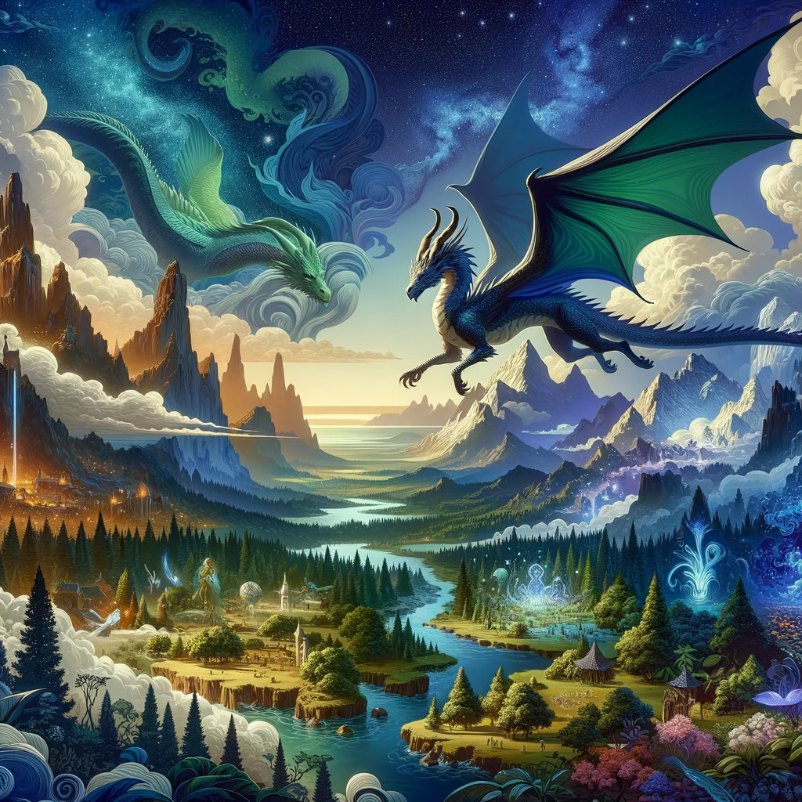
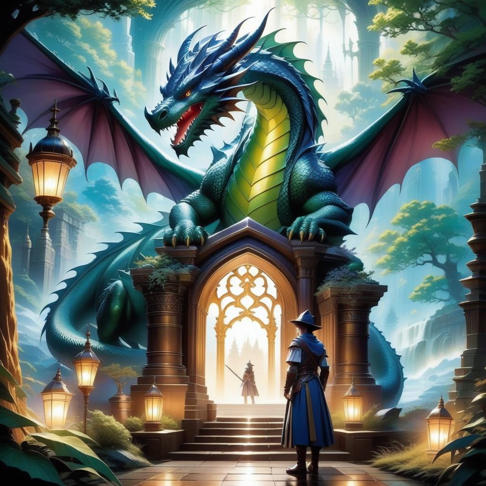

# MakeMyTale: Customized Storytelling through AI

## Summary
MakeMyTale is a unique AI-driven platform that offers personalized storytelling experiences. Users can input their own ideas and preferences to generate custom, engaging stories.

## Key Points
- AI-driven storytelling platform
- Personalized story generation
- User-friendly interface
- Ideal for creative writing and education

## Pros and Cons

| Pros                                      | Cons                                 |
|-------------------------------------------|--------------------------------------|
| Customizable story options                | Limited to text-based stories        |
| Enhances creativity and writing skills    | May not capture nuanced storytelling |
| Great educational tool for children       | Depends on user inputs for quality   |
| Accessible and user-friendly              | Requires internet connection        |

## Tips for the Reader 📖
🌟 Experiment with different themes and characters.
✍️ Use it as a tool to spark your own creative writing.
👶 Introduce children to storytelling and writing.
🔍 Explore various genres for diverse storytelling experiences.

## Examples

**Example 1: Fantasy Adventure**
- **Input:** Fantasy world, dragons, quest
- **Output:** A tailored story about a dragon's quest in a fantasy realm.

**Example 2: Sci-Fi Exploration**
- **Input:** Space travel, alien planets, discovery
- **Output:** A narrative of interstellar exploration and alien encounters.

👉 [**Try MakeMyTale for yourself**](https://makemytale.com/)

## URL Address of the AI Topic / Vendor
[MakeMyTale Official Site](https://makemytale.com/)

## Follow our Social Media for more information
- 📘 <a href="https://www.facebook.com/groups/trionxai" target="_blank">FB group: Trionx AI Group</a>
- 👍 <a href="https://www.facebook.com/ai.trionxai" target="_blank">FB page: Trionx AI Page</a>
- 📸 <a href="https://www.instagram.com/trionxai/" target="_blank">Instagram: Trionx AI Instagram</a>
- ▶️ <a href="https://www.youtube.com/@robotdocs/" target="_blank">Youtube: Trionx AI YouTube</a>

## SEO High Ranking Page Tags
MakeMyTale, AI Storytelling, Personalized Stories, Creative Writing, Educational Tool, Children's Stories, Custom Stories, Interactive Storytelling, Digital Storytelling, Narrative Generation, AI Writing, Story Generation, Educational AI, Storytelling for Kids, Creative AI, Story Customization, AI for Education, Storytelling Platform, AI and Creativity, User-Generated Stories

