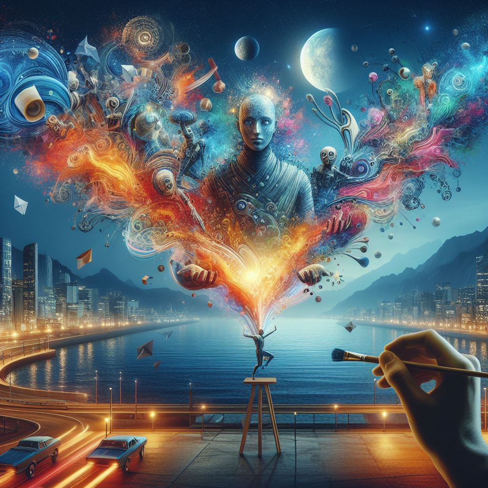

## Masterpiece X: Elevating Creativity with AI-Driven Artistic Innovation

### Summary
Masterpiece X, accessible at [masterpiecex.com](https://masterpiecex.com), provides a platform leveraging AI to empower artistic creation. This article delves into how Masterpiece X utilizes advanced AI algorithms to revolutionize artistic expression, fostering creativity in novel and innovative ways.



### Key Points

1. **Introduction to Masterpiece X:** Highlighting [masterpiecex.com](https://masterpiecex.com)'s role in transforming artistic expression through AI-driven innovations.
2. **AI's Role in Artistic Creation:** Exploring how Masterpiece X harnesses AI to enhance artistic endeavors and inspire creativity.
3. **Pros and Cons** (Table Format):

| Pros                                 | Cons                                |
|--------------------------------------|-------------------------------------|
| AI-facilitated creative exploration   | Learning curve for new users        |
| Innovative artistic possibilities     | Dependency on user input quality    |
| Simplified artistic processes         | Varied output quality               |

### Tips for the Reader 💡
Maximizing Artistic Endeavors with Masterpiece X:
- Experiment with various artistic tools available on the platform to understand their functionalities.
- Engage with tutorials and community resources to unlock the full potential of Masterpiece X's AI-driven tools.
- Utilize diverse artistic styles and subjects to leverage the platform effectively.

### Examples (if applicable)

#### Example 1: AI-Assisted Art Generation
**Prompt:** Creating Art with Masterpiece X

**Input**
```dart
created_art = MasterpieceX.generate_art(style, preferences)
```

**Output**
```dart
Art generated based on specified style and preferences using Masterpiece X's AI-assisted creation tools.
```

#### Example 2: Innovative Artistic Styles
**Prompt:** Exploring Artistic Styles with Masterpiece X

**Input**
```dart
explored_styles = MasterpieceX.explore_styles(category, options)
```

**Output**
```dart
Artistic exploration within specified categories and options using Masterpiece X's innovative style exploration tools.
```

Try for Yourself 👉 <a href="https://www.masterpiecex.com" target="_blank">Explore Masterpiece X</a>

## URL Address
- <a href="https://www.masterpiecex.com" target="_blank">Masterpiece X - AI-Driven Artistic Innovation</a>

### Follow our Social Media for more information:
- 📘 <a href="https://www.facebook.com/groups/trionxai" target="_blank">Facebook Group: Trionxai</a>
- 👍 <a href="https://www.facebook.com/ai.trionxai" target="_blank">Facebook Page: AI Trionxai</a>
- 📸 <a href="https://www.instagram.com/trionxai/" target="_blank">Instagram: Trionxai</a>
- ▶️ <a href="https://www.youtube.com/@robotdocs/" target="_blank">Youtube: Robotdocs</a>

<hr>

### SEO High Ranking Page Tags
AI, Masterpiece X, Artistic Creation, AI-Driven Innovations, Art Generation, Artificial Intelligence, Advanced Artistic Tools, AI Applications, Creative Expression, AI Advancements