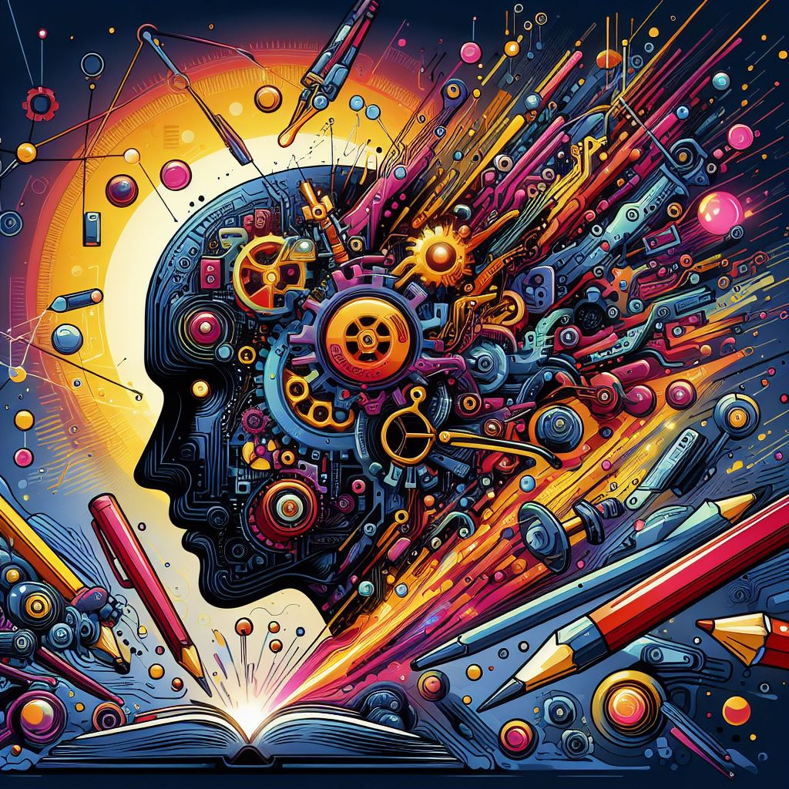

## MightyGPT: Empowering Creativity through Advanced AI-Powered Text Generation

### Summary
Embark on a journey of creativity and innovation with MightyGPT, a platform that empowers users through advanced AI-powered text generation. This article explores the key features of MightyGPT, outlines its pros and cons, provides actionable tips for users, and presents real-world examples showcasing how it elevates creative writing with cutting-edge AI technology.



### Key Points
- Advanced AI-Powered Text Generation for Creative Writing
- Versatile and Context-Aware Text Output
- User-Friendly Interface for Intuitive Writing
- Seamless Integration into Creative Workflows

### Pros and Cons

| Pros                             | Cons                                               |
| -------------------------------- | -------------------------------------------------- |
| AI-Powered Text Generation        | Some Advanced Features Limited to Premium Users   |
| Versatile and Context-Aware Output| Learning Curve for Customizing Advanced Features |
| User-Friendly Interface           | Internet Connection Required for Real-Time Writing |
| Creative Workflow Integration     | Premium Subscription May Be Required for Full Access|

### Tips for the Reader 💡
Maximize your MightyGPT experience with these tips:
- Leverage advanced AI-powered text generation for versatile and context-aware writing.
- Utilize the user-friendly interface for intuitive and seamless creative writing.
- Consider the premium features for access to advanced AI-driven creative writing capabilities.

### Examples

#### Example 1: AI-Generated Short Story
**Prompt:** AI-Generated Short Story with MightyGPT

**Input:**
```dart
{
  "story_theme": "mystery",
  "characters": ["Detective Smith", "Dr. Watson"],
  "setting": "victorian London"
}
```

**Output:**
```dart
[MightyGPT creating a mystery short story set in victorian London with Detective Smith and Dr. Watson]
```

#### Example 2: AI-Generated Poem
**Prompt:** AI-Generated Poem with MightyGPT

**Input:**
```dart
{
  "poem_theme": "nature",
  "style": "haiku",
  "keywords": ["blossom", "stream", "moon"]
}
```

**Output:**
```dart
[MightyGPT crafting a nature-themed haiku poem with keywords blossom, stream, and moon]
```

👉 <a href="https://www.mightygpt.com/" target="_blank">Try for yourself</a>

### URL Address of the AI Topic / Vendor
<a href="https://www.mightygpt.com/" target="_blank">MightyGPT</a>

---

Follow our Social Media for more information:

- 📘 <a href="https://www.facebook.com/groups/trionxai" target="_blank">Facebook Group</a>
- 👍 <a href="https://www.facebook.com/ai.trionxai" target="_blank">Facebook Page</a>
- 📸 <a href="https://www.instagram.com/trionxai/" target="_blank">Instagram</a>
- ▶️ <a href="https://www.youtube.com/@robotdocs/" target="_blank">YouTube</a>

### SEO High-Ranking Page Tags
MightyGPT, AI-Powered Text Generation, Creative Writing, Context-Aware Output, User-Friendly Interface, Creative Workflows, Premium Features, AI-Driven Creative Writing Capabilities