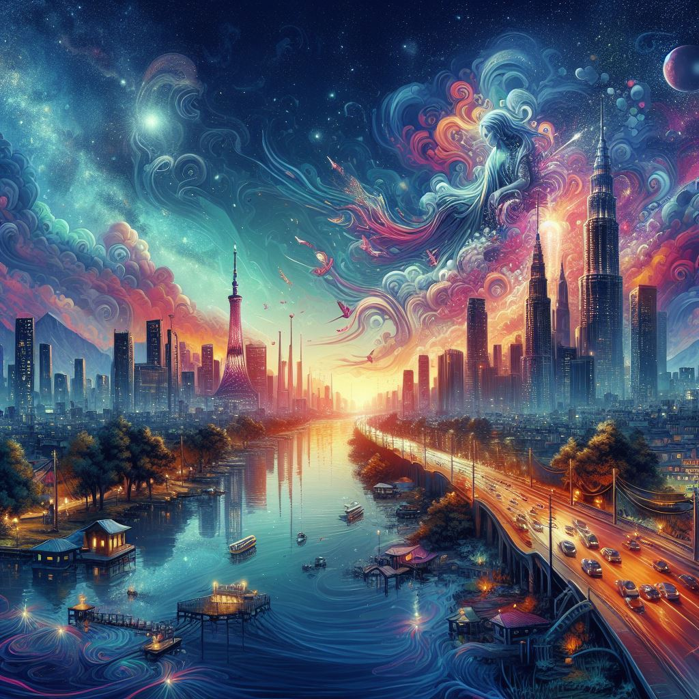

## Mirage: Redefining Visual Storytelling with AI-Driven Imagery

### Summary
Mirage, accessible at mirageml.com, presents an innovative platform that harnesses AI for visual storytelling. This article delves into how Mirage employs advanced AI algorithms to revolutionize image manipulation and elevate visual content creation.



### Key Points

1. **Introduction to Mirage:** Unveiling mirageml.com's pivotal role in transforming visual storytelling through AI-powered innovations.
2. **AI's Role in Visual Content:** Exploring how Mirage leverages AI to enhance image manipulation and streamline visual content creation processes.
3. **Pros and Cons** (Table Format):

| Pros                                 | Cons                                |
|--------------------------------------|-------------------------------------|
| Advanced image manipulation capabilities | Learning curve for new users      |
| Diverse visual content creation tools | Dependency on predefined models    |
| Simplifies complex visual storytelling| Variability in output quality       |

### Tips for the Reader 💡
Exploring Visual Storytelling with Mirage:
- Experiment with diverse visual content creation tools on the platform to grasp its capabilities.
- Engage with tutorials and community resources to maximize the potential of Mirage's AI-driven tools.
- Utilize various imagery to effectively leverage the platform's AI-powered visual storytelling.

### Examples

#### Example 1: AI-Enhanced Image Manipulation
**Prompt:** Manipulating Images using Mirage

**Input**
```dart
manipulated_image = Mirage.manipulate_image(image, techniques)
```

**Output**
```dart
An image manipulated using specified techniques and tools within Mirage's platform.
```

#### Example 2: Advanced Visual Story Creation
**Prompt:** Creating Visual Stories with Mirage

**Input**
```dart
visual_story = Mirage.create_visual_story(elements, themes)
```

**Output**
```dart
A visual story created based on specified elements and themes using Mirage's advanced storytelling tools.
```

#### Example 3: AI-Generated Imagery
**Prompt:** Generating AI-Driven Imagery with Mirage

**Input**
```dart
ai_imagery = Mirage.generate_imagery(preferences)
```

**Output**
```dart
Imagery generated based on provided preferences using Mirage's AI-driven image generation features.
```

Try for Yourself 👉 <a href="https://mirageml.com" target="_blank">Explore Mirage</a>

## URL Address
- <a href="https://mirageml.com" target="_blank">Mirage - AI-Driven Visual Storytelling</a>

### Follow our Social Media for more information:
- 📘 <a href="https://www.facebook.com/groups/trionxai" target="_blank">Facebook Group: Trionxai</a>
- 👍 <a href="https://www.facebook.com/ai.trionxai" target="_blank">Facebook Page: AI Trionxai</a>
- 📸 <a href="https://www.instagram.com/trionxai/" target="_blank">Instagram: Trionxai</a>
- ▶️ <a href="https://www.youtube.com/@robotdocs/" target="_blank">Youtube: Robotdocs</a>

<hr>

### SEO High Ranking Page Tags
AI, Mirage, Visual Storytelling, AI-Driven Imagery, Artificial Intelligence, Advanced Content Creation, AI Applications, Visual Storytelling Tools, AI Advancements