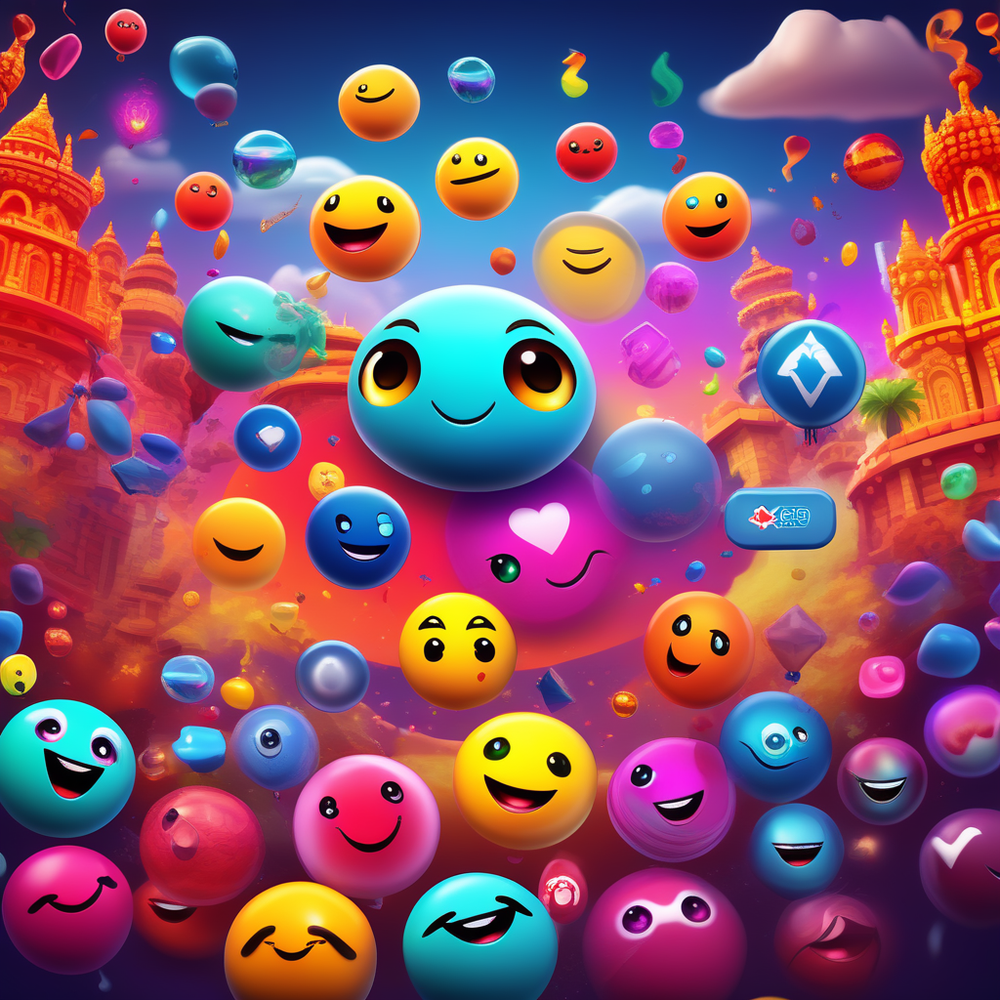
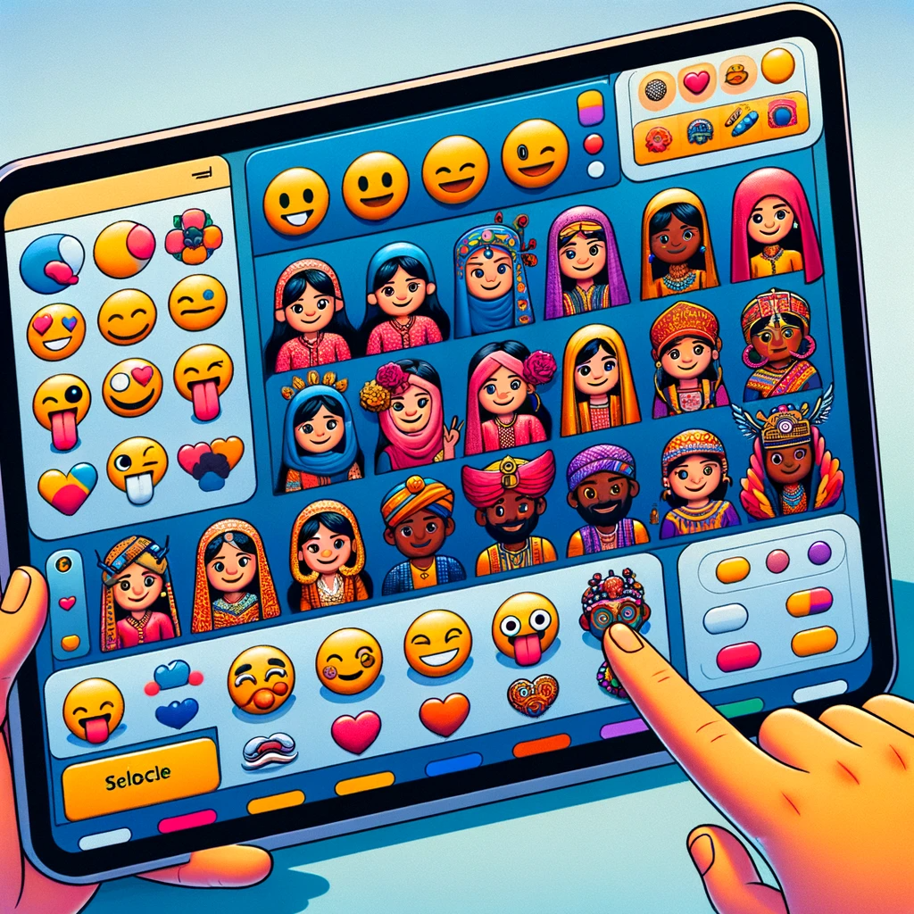

# Moji: Transforming Communication with AI-Enhanced Emojis

## Summary:
Moji is an innovative AI platform dedicated to revolutionizing digital communication through personalized and dynamic emojis. It uses AI to create a diverse range of emojis that better represent emotions, cultures, and personal styles, making digital conversations more expressive and inclusive.

## Key Points:
- AI-powered emoji customization.
- Enhances digital communication with diverse representations.
- User-friendly interface for personalized emoji creation.

## Pros and Cons:

| Pros                                  | Cons                                       |
|---------------------------------------|--------------------------------------------|
| Diverse and inclusive emoji options   | Requires understanding of the customization tools |
| Enhances personal expression in digital communication | Limited to platforms that support custom emojis  |
| Continuously updated with new features and styles | May require subscription for full access  |

## 🌟 Tips for the Reader:
- 😊 Experiment with different styles to reflect your personality.
- 🌍 Explore culturally diverse emoji options.
- 🔄 Regularly update your collection with new releases.

## Examples:

### Example 1: Personalized Emoji Set
- **Prompt:** Expressive Personal Emojis
- **Input:** User's preferences, interests, and style.
- **Output:** A set of custom emojis tailored to the user’s personality.

### Example 2: Cultural Representation
- **Prompt:** Culturally Diverse Emojis
- **Input:** Specific cultural themes and symbols.
- **Output:** A range of emojis representing various cultural aspects.

👉 [**Try for yourself**](https://www.mojiai.io/)

## URL Address of the AI Topic / vendor:
- [Moji Official Website](https://www.mojiai.io/)

---

**Follow our Social Media for more information:**
- 📘 <a href="https://www.facebook.com/groups/trionxai" target="_blank">FB group: Trionx AI Group</a>
- 👍 <a href="https://www.facebook.com/ai.trionxai" target="_blank">FB page: Trionx AI Page</a>
- 📸 <a href="https://www.instagram.com/trionxai/" target="_blank">Instagram: Trionx AI Instagram</a>
- ▶️ <a href="https://www.youtube.com/@robotdocs/" target="_blank">Youtube: Trionx AI YouTube</a>

---

## SEO High Ranking Page Tags:
Moji, AI emojis, personalized emojis, digital communication, emoji customization, diverse emojis, cultural representation in emojis, expressive emojis, AI in communication, user-friendly emoji maker, digital conversation tools, emotive digital expressions, custom emoji designs, cultural emojis, communication enhancement, emotional expression, personal style emojis, Moji AI, inclusive digital tools, emoji innovation

