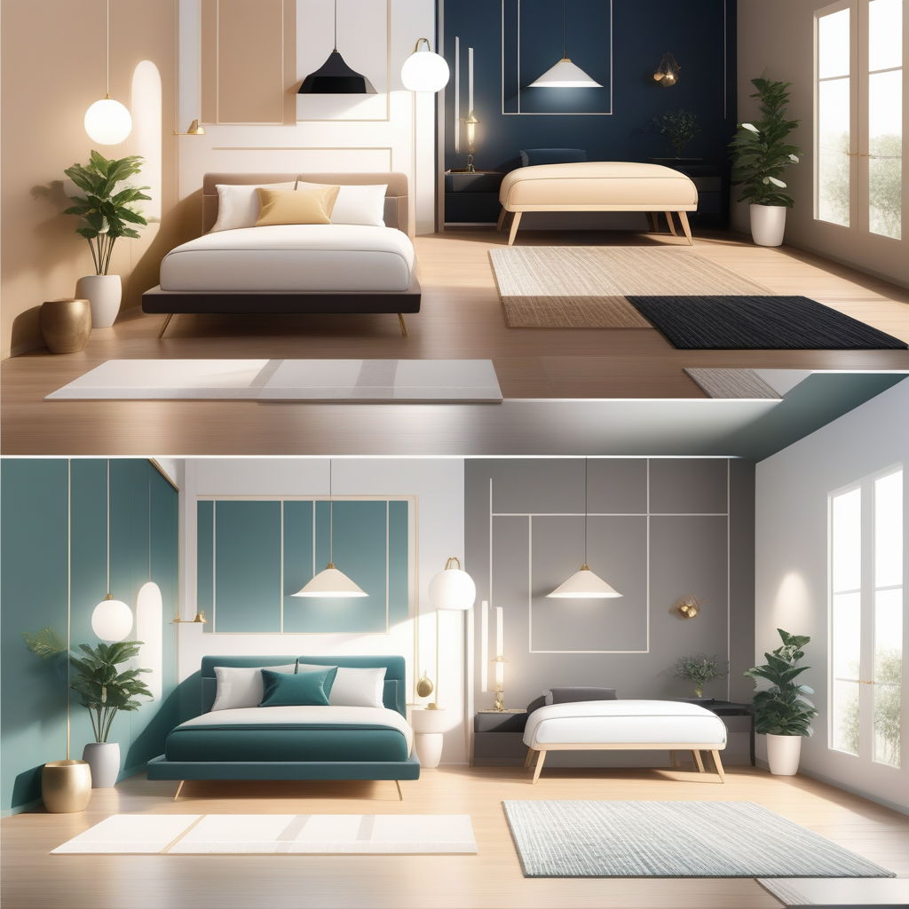
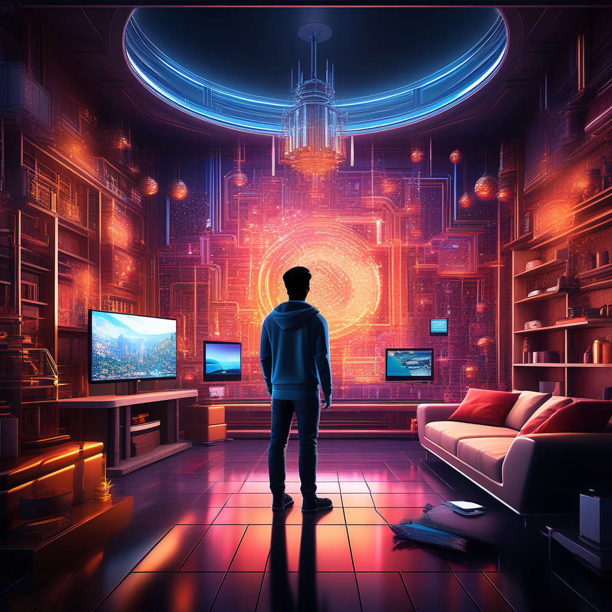

# MyRoomDesigner.ai: Revolutionizing Interior Design with AI

## Summary:
MyRoomDesigner.ai is an advanced AI-driven platform that transforms the interior design process, making it more accessible and efficient. It utilizes artificial intelligence to help users visualize and design their spaces with ease, offering a user-friendly interface and a wide range of design options.

    

## Key Points:
- AI-powered room design and visualization tools.
- Easy-to-use interface for both professionals and amateurs.
- Customizable design options to suit various tastes and needs.

## Pros and Cons:

| Pros                                  | Cons                                  |
|---------------------------------------|---------------------------------------|
| Intuitive design process              | Limited by the styles available in the AI |
| Real-time visualization of design changes | Requires internet connectivity         |
| Wide range of furniture and decor options | May need subscription for full access  |

## 🌟 Tips for the Reader:
- 🏠 Experiment with different styles and layouts to find your perfect design.
- 🎨 Use the color palette tool for cohesive interior themes.
- 📏 Take accurate room measurements for realistic design renderings.

## Examples:

### Example 1: Living Room Makeover
- **Prompt:** Cozy and Modern Living Space
- **Input:** Dimensions of the living room and preferred style.
- **Output:** A 3D-rendered design of a modern, cozy living room.

### Example 2: Office Space Design
- **Prompt:** Functional Home Office
- **Input:** Small room specifications for a home office.
- **Output:** Efficient and stylish home office design.

### 👉 [Try for yourself](<https://www.myroomdesigner.ai/>)

### URL Address of the AI Topic / Vendor
### [Insert Vendor URL Here](<https://www.myroomdesigner.ai/>)

### Follow our Social Media for more information
- 📘 [FB group: Trionx AI Group](https://www.facebook.com/groups/trionxai){:target="_blank"}
- 👍 [FB page: Trionx AI Page](https://www.facebook.com/ai.trionxai){:target="_blank"}
- 📸 [Instagram: Trionx AI Instagram](https://www.instagram.com/trionxai/){:target="_blank"}
- ▶️ [Youtube: Trionx AI YouTube](https://www.youtube.com/@robotdocs/){:target="_blank"}

## SEO High Ranking Page Tags:
MyRoomDesigner.ai, AI interior design, room visualization, home decor, 3D rendering, design tools, virtual room planning, home renovation, AI technology, interior styling, home makeover, online design platform, customizable interiors, digital room design, furniture layout, decor planning, smart design, interior innovation, space optimization, AI design solutions

