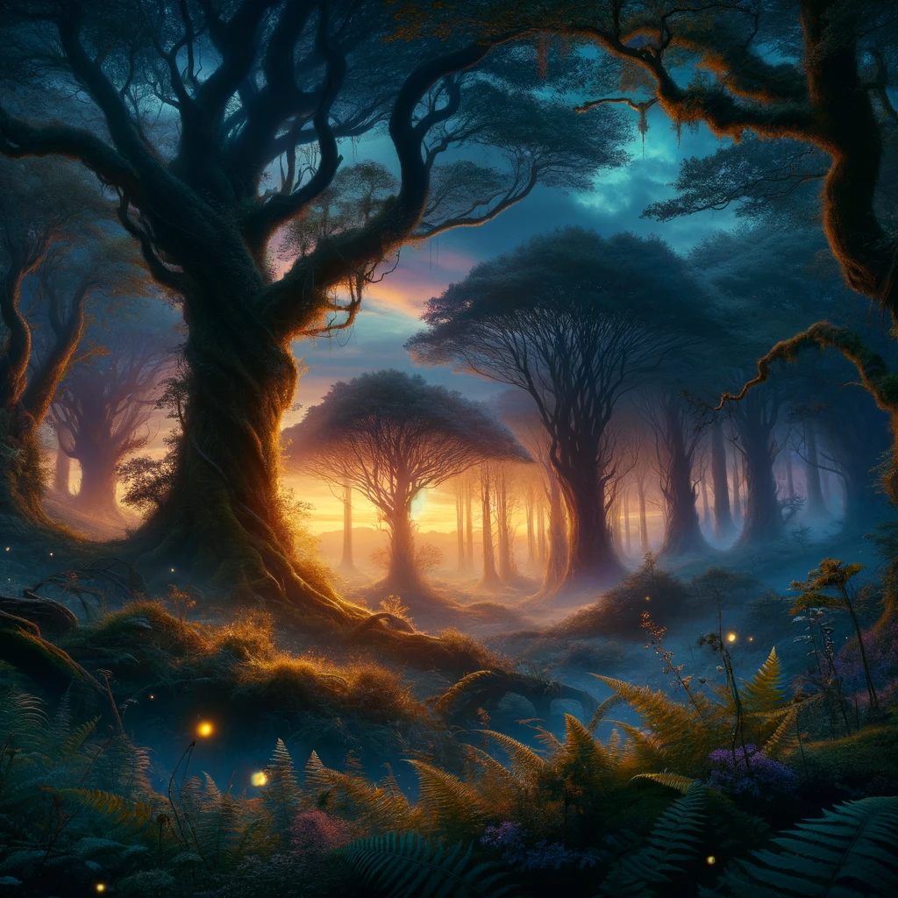

# NightCafe: Redefining Art with AI

## Summary
NightCafe is an innovative AI-powered platform that offers users unique tools to create digital art. It utilizes advanced algorithms to transform simple inputs into stunning visuals, catering to both amateur and professional artists.

## Key Points
- AI-powered art generation  
- User-friendly interface  
- Supports various art styles  
- High-quality output  

## Pros and Cons

| Pros                      | Cons                        |
|---------------------------|-----------------------------|
| Intuitive interface       | Limited free usage          |
| High-quality results      | Can be resource-intensive   |
| Diverse style options     | May require learning curve  |
| Regular updates           | -                           |

## Examples

### Example 1: Fantasy Landscape  
- Input: A mystical forest at dusk  
- Output: A beautifully rendered image of a forest bathed in twilight hues.

### Example 2: Abstract Art 
- **Input:** Geometric shapes in a chaotic arrangement  
- **Output:** A modern art piece with vibrant colors and abstract patterns.

👉 [**Try for yourself**](https://creator.nightcafe.studio/)

## URL Address of the AI Topic / Vendor
[https://creator.nightcafe.studio/](https://creator.nightcafe.studio/)

## Follow our Social Media for more information
- 📘 <a href="https://www.facebook.com/groups/trionxai" target="_blank">FB group: Trionx AI Group</a>
- 👍 <a href="https://www.facebook.com/ai.trionxai" target="_blank">FB page: Trionx AI Page</a>
- 📸 <a href="https://www.instagram.com/trionxai/" target="_blank">Instagram: Trionx AI Instagram</a>
- ▶️ <a href="https://www.youtube.com/@robotdocs/" target="_blank">Youtube: Trionx AI YouTube</a>

---

## Quiz Questions

1. What is the main purpose of NightCafe?
   - a) Video editing  
   - b) AI-powered art generation  
   - c) Music composition  
   - d) Data analysis  
   **Answer:** b) AI-powered art generation

2. What type of interface does NightCafe offer?
   - a) Complex and technical  
   - b) Intuitive and user-friendly  
   - c) Text-based only  
   - d) VR interface  
   **Answer:** b) Intuitive and user-friendly

3. What is a limitation of NightCafe?
   - a) No abstract art styles  
   - b) Limited free usage  
   - c) Only black and white output  
   - d) No support for professional artists  
   **Answer:** b) Limited free usage

4. What is essential for creating art with NightCafe?
   - a) Advanced coding skills  
   - b) A professional art degree  
   - c) Creativity and exploration  
   - d) A powerful computer  
   **Answer:** c) Creativity and exploration

5. Which of these is not a feature of NightCafe?
   - a) Regular updates  
   - b) High-quality results  
   - c) Supports only one art style  
   - d) Diverse style options  
   **Answer:** c) Supports only one art style

## SEO High Ranking Page Tags
AI Art, Digital Art, NightCafe, Creative AI, Art Generation, User-Friendly AI, Abstract Art, AI Tools, Innovative Art, Tech Art, Art Technology, Digital Creativity, Artistic AI, AI-Driven Design, AI for Artists, Tech for Creativity, AI Innovation in Art, AI and Art, NightCafe Studio, Artistic Technology

