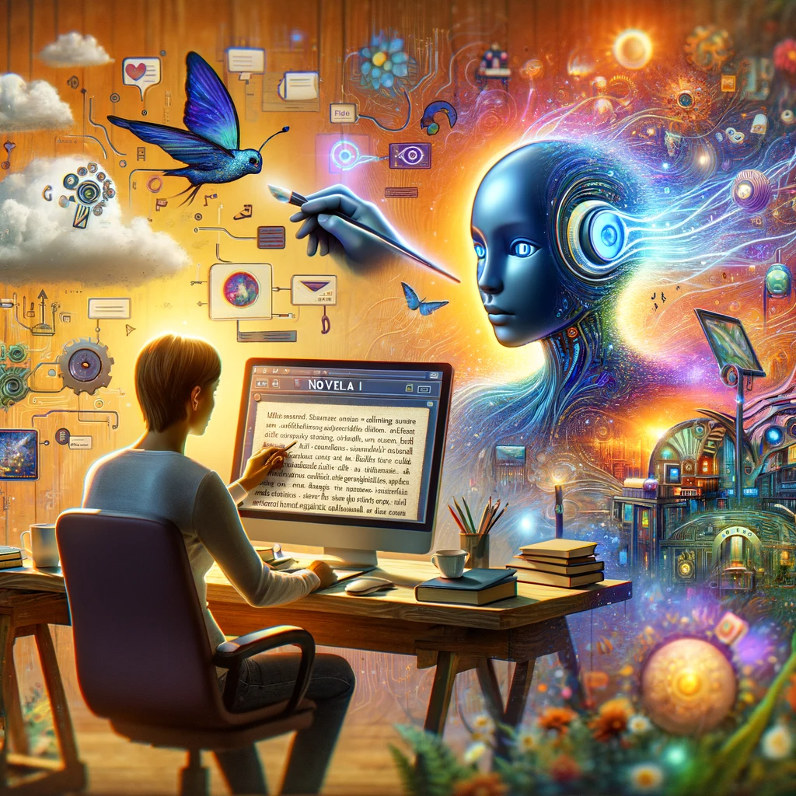

# NovelAI: Pioneering AI-Driven Storytelling

## Summary:
NovelAI is an AI-based platform that revolutionizes storytelling and creative writing. It leverages advanced AI algorithms to assist writers in generating narratives, characters, and plot ideas. This tool is perfect for authors, screenwriters, and anyone interested in exploring the bounds of AI-assisted creative writing.

## Key Points:
- AI-powered storytelling and narrative generation.
- Intuitive interface for writers of all skill levels.
- Customizable settings for genre, style, and plot development.

## Pros and Cons:

| Pros                                     | Cons                                     |
|------------------------------------------|------------------------------------------|
| Enhances creative writing with AI assistance | Output may sometimes require refinement  |
| Offers a wide range of narrative possibilities | Subscription model for full features     |
| User-friendly for both amateur and professional writers | AI-generated content may lack a personal touch |

## 🌟 Tips for the Reader:
- 📚 Use NovelAI to overcome writer's block and generate new ideas.
- ✍️ Experiment with different genres and styles for inspiration.
- 🔄 Regularly update your preferences to refine the AI outputs.

## Examples:

### Example 1: Fantasy Story Creation
- **Prompt:** Epic Fantasy Tale
- **Input:** Basic plot outline and character descriptions.
- **Output:** A detailed narrative with complex characters and immersive world-building.

### Example 2: Sci-Fi Short Story
- **Prompt:** Futuristic Sci-Fi Adventure
- **Input:** Setting in a distant future with advanced technology.
- **Output:** A short story exploring futuristic themes and technologies.

👉 [**Try for yourself**](https://novelai.net/)

## URL Address of the AI Topic / vendor:
- [NovelAI Official Website](https://novelai.net/)

---

**Follow our Social Media for more information:**
- 📘 <a href="https://www.facebook.com/groups/trionxai" target="_blank">FB group: Trionx AI Group</a>
- 👍 <a href="https://www.facebook.com/ai.trionxai" target="_blank">FB page: Trionx AI Page</a>
- 📸 <a href="https://www.instagram.com/trionxai/" target="_blank">Instagram: Trionx AI Instagram</a>
- ▶️ <a href="https://www.youtube.com/@robotdocs/" target="_blank">Youtube: Trionx AI YouTube</a>

---

## SEO High Ranking Page Tags:
NovelAI, AI storytelling, creative writing tool, AI for writers, narrative generation, AI-assisted writing, storytelling technology, digital narratives, AI creativity, writing enhancement, plot development, character creation, story generation, AI in literature, automated storytelling, creative narratives, fiction writing, novel creation, AI writing assistant, story crafting

