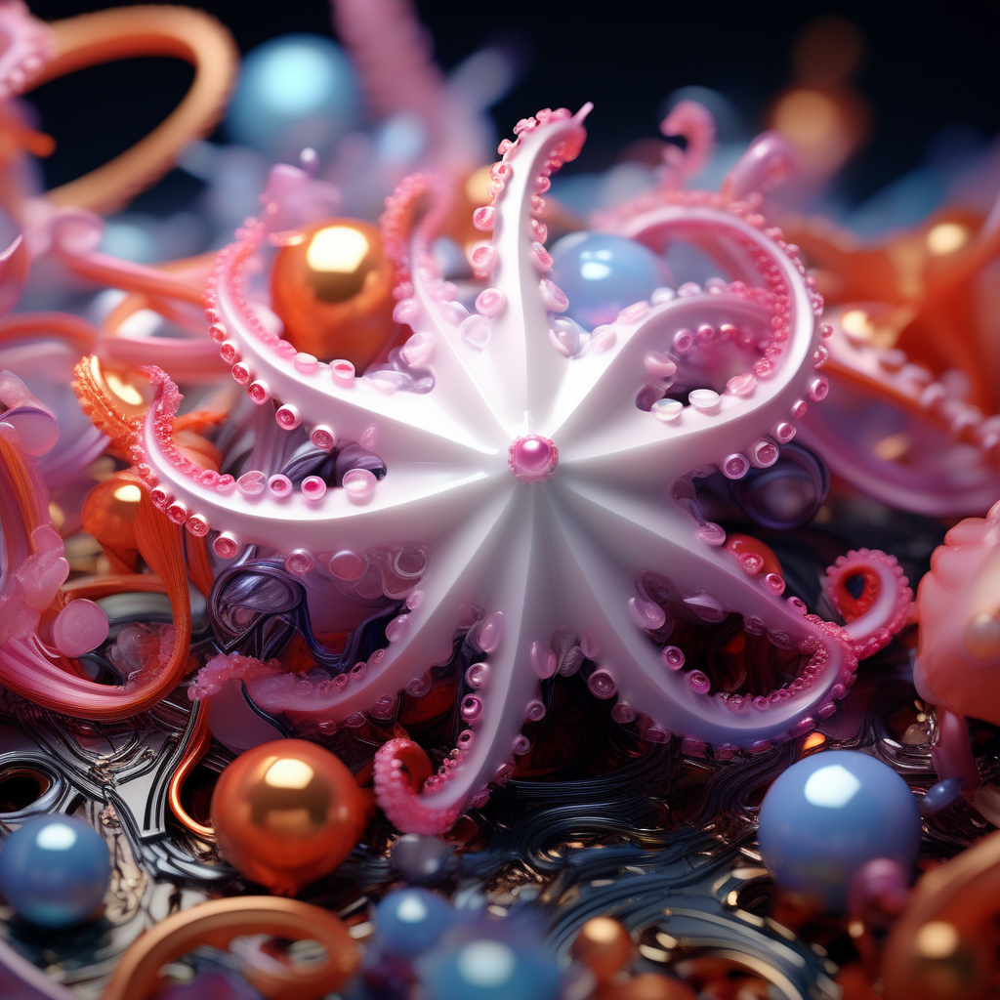
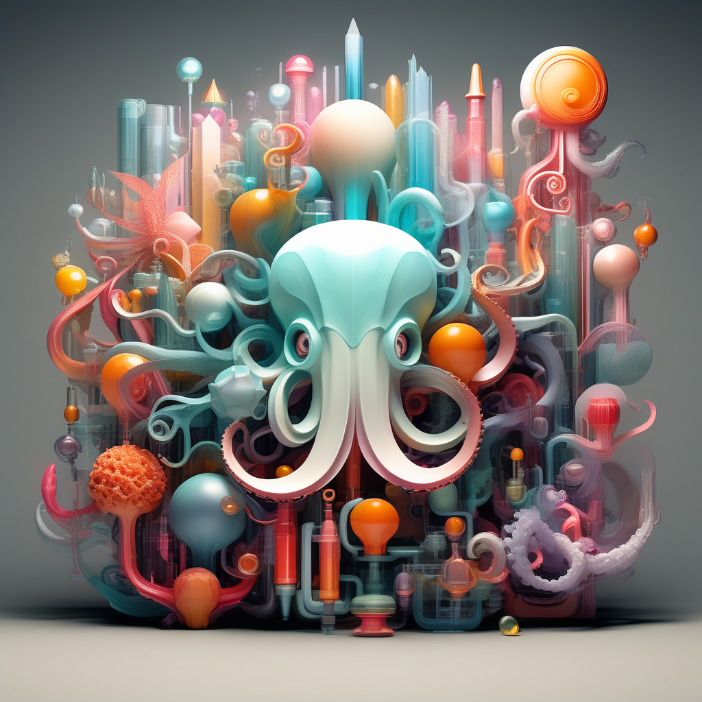
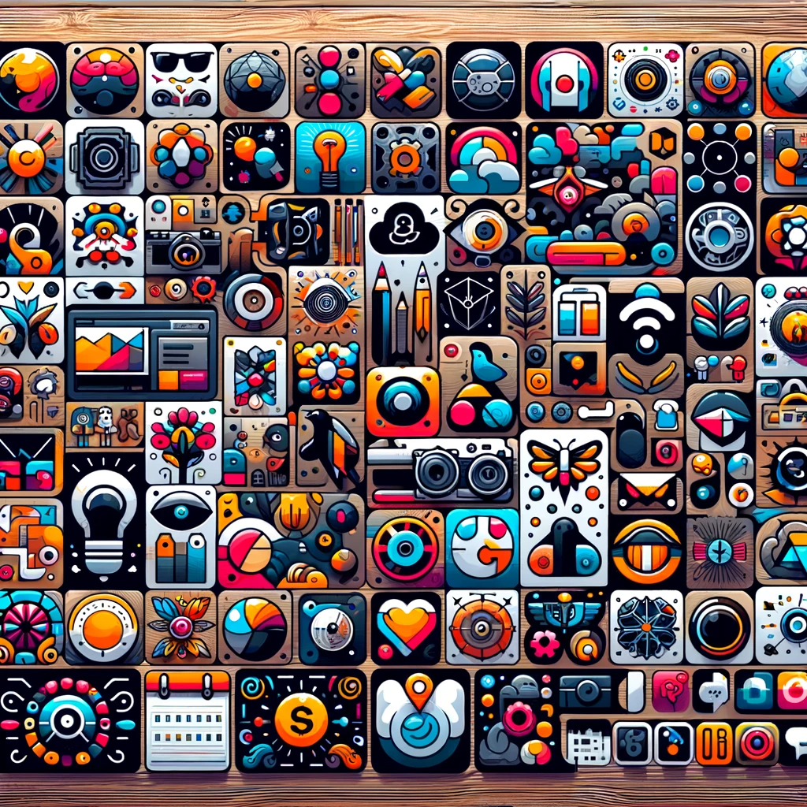

# Octoicons: Creative Iconography for Modern Design

## Summary:
Octoicons is a dynamic platform offering a diverse range of creative and versatile icons for digital design. It caters to designers, developers, and content creators seeking high-quality icons to enhance their projects. With a focus on modern aesthetics and user-friendly functionality, Octoicons stands out as a top choice for digital iconography.

## Key Points:
- Extensive library of modern, versatile icons.
- Easy integration into various digital projects.
- Customizable icons to fit specific design needs.

## Pros and Cons:

| Pros                                  | Cons                                      |
|---------------------------------------|-------------------------------------------|
| Wide variety of icon styles           | Requires basic design knowledge to customize |
| High-quality, professional designs    | Limited free version; more options in paid version |
| Regular updates with new icons        | May need internet access for full library  |

## 🌟 Tips for the Reader:
- 🎨 Mix and match different icons for unique designs.
- 🔍 Utilize search and filter options to find specific icons.
- 🔄 Regularly check for new additions to expand your options.

## Examples:

### Example 1: Website Icon Set
- **Prompt:** Cohesive Web Design
- **Input:** Website theme and color scheme.
- **Output:** A set of matching icons enhancing the website's aesthetic.

### Example 2: App Interface Design
- **Prompt:** User-Friendly App Icons
- **Input:** App functionality and user interface requirements.
- **Output:** Intuitive and appealing icons for app navigation.

👉 [**Try for yourself**](https://octoicons.com/)

## URL Address of the AI Topic / vendor:
- [Octoicons Official Website](https://octoicons.com/)

---

**Follow our Social Media for more information:**
- 📘 <a href="https://www.facebook.com/groups/trionxai" target="_blank">FB group: Trionx AI Group</a>
- 👍 <a href="https://www.facebook.com/ai.trionxai" target="_blank">FB page: Trionx AI Page</a>
- 📸 <a href="https://www.instagram.com/trionxai/" target="_blank">Instagram: Trionx AI Instagram</a>
- ▶️ <a href="https://www.youtube.com/@robotdocs/" target="_blank">Youtube: Trionx AI YouTube</a>

---

## SEO High Ranking Page Tags:
Octoicons, digital icons, creative iconography, modern design, web icons, app interface design, user-friendly icons, design aesthetics, icon library, digital design resources, customizable icons, professional icons, UI design, UX enhancements, graphic design, creative assets, digital content creation, icon sets, design tools, visual elements

