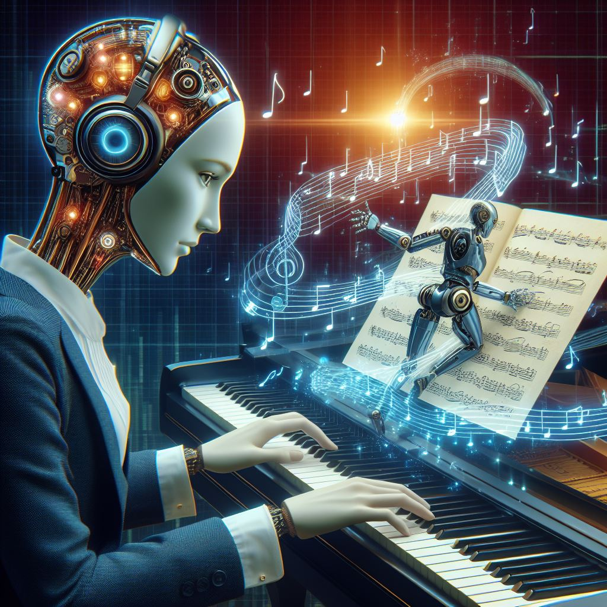

## OneTone.ai: Elevating Music Composition with AI Precision

### Summary:
OneTone.ai, accessible at onetone.ai, stands as an innovative platform revolutionizing music composition through AI-driven capabilities. This cutting-edge tool aims to assist musicians and composers in creating captivating melodies and harmonies.



### Key Points:
- **AI-Driven Melody Generation:** OneTone.ai employs AI algorithms to generate melodies and harmonies, assisting musicians in the creative process.
- **Creative Collaboration:** The platform fosters collaboration among musicians, offering tools for shared compositions and harmonious creation.
- **Enhanced Music Exploration:** OneTone.ai allows musicians to explore diverse musical genres and styles, expanding their creative horizons.

### Pros and Cons:

| Pros                            | Cons                                      |
|---------------------------------|-------------------------------------------|
| AI-driven melody generation     | Initial learning curve for new users       |
| Collaborative composition tools | Dependency on consistent data accuracy     |
| Diverse music exploration       | Continuous monitoring for optimal results  |

### Tips for the Reader 🌀:
To harness the potential of OneTone.ai, explore its AI-driven features and collaborate with other musicians. Ensure consistent data input for accurate and diverse music composition.

### Examples:

#### Example 1: AI-Generated Melody Composition
**Prompt:**
```dart
"Generate a melody in jazz style with upbeat tempo and piano instrumentation"
```
**Input:**
```
"Generate a melody in jazz style with upbeat tempo and piano instrumentation"
```
**Output:**
```
[OneTone.ai generating a melody in jazz style with an upbeat tempo and piano instrumentation based on the prompt]
```

#### Example 2: Collaborative Composition Session
**Prompt:**
```dart
"Collaborate with other musicians in real-time to create a new composition"
```
**Input:**
```
"Collaborate with other musicians in real-time to create a new composition"
```
**Output:**
```
[OneTone.ai enabling real-time collaborative composition with other musicians]
```

👉 <a href="https://www.onetone.ai/" target="_blank">Try for yourself</a>

### URL Address of the AI Topic / Vendor
<a href="https://www.onetone.ai/" target="_blank">OneTone.ai</a>

Follow our Social Media for more information:
- 📘 <a href="https://www.facebook.com/groups/trionxai" target="_blank">Facebook Group</a>
- 📄 <a href="https://www.facebook.com/ai.trionxai" target="_blank">Facebook Page</a>
- 📸 <a href="https://www.instagram.com/trionxai/" target="_blank">Instagram</a>
- 🎥 <a href="https://www.youtube.com/@robotdocs/" target="_blank">YouTube</a>

<hr>

### SEO Tags:
AI, OneTone.ai, Music Composition, AI-powered Melody Generation, Creative Collaboration, Music Exploration, AI Technology, Collaborative Music Composition, Musical Innovation, AI in Music, Musician's Tools, Harmonious Creations.