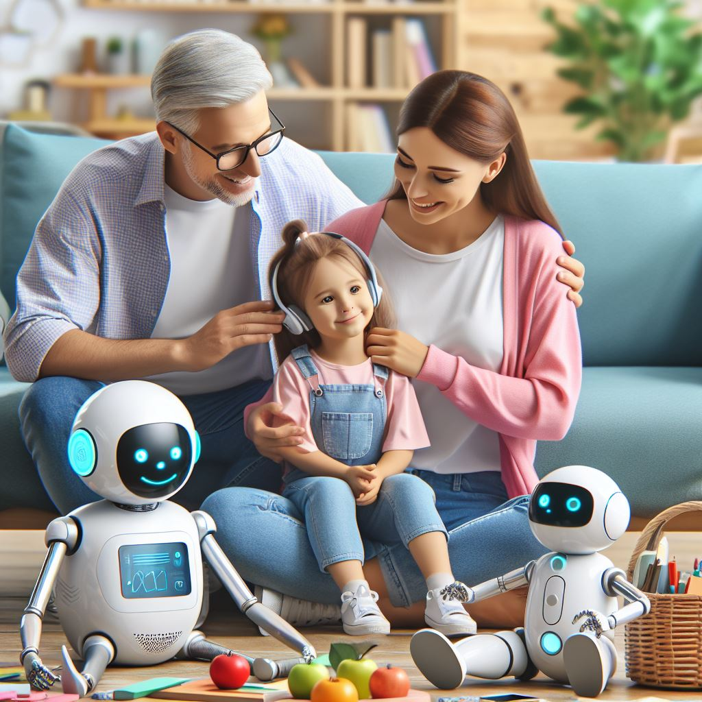

## Parentivity Bot: Nurturing Parental Support with AI Assistance

### Summary:
Parentivity Bot, accessible at parentivity.in, stands as an AI-powered companion designed to assist parents in navigating the challenges of parenthood. This innovative solution aims to provide guidance, resources, and support to foster effective parenting.



### Key Points:
- **AI-guided Parental Support:** Parentivity Bot offers personalized guidance and resources, leveraging AI to address specific parenting concerns and queries.
- **Resourceful Assistance:** The platform provides a wide array of resources, including articles, tips, and expert advice, tailored to parents' needs.
- **Community Engagement:** Parentivity Bot encourages community engagement, facilitating discussions and interactions among parents for shared learning and support.

### Pros and Cons:

| Pros                            | Cons                                      |
|---------------------------------|-------------------------------------------|
| Personalized parental guidance  | Initial learning curve for new users       |
| Resourceful support materials   | Dependency on consistent and updated content |
| Community engagement features  | Continuous refinement for optimal results  |

### Tips for the Reader 🌀:
To make the most of Parentivity Bot, explore its personalized guidance features. Stay engaged with the community and regularly access updated resources for effective parenting.

### Examples:

#### Example 1: AI-guided Parenting Advice
**Prompt:**
```dart
"Provide advice on managing screen time for children aged 5-10"
```
**Input:**
```
"Provide advice on managing screen time for children aged 5-10"
```
**Output:**
```
[Parentivity Bot providing advice on managing screen time for children aged 5-10 based on the prompt]
```

#### Example 2: Resourceful Parenting Tips
**Prompt:**
```dart
"Offer tips on fostering creativity in children through play-based learning"
```
**Input:**
```
"Offer tips on fostering creativity in children through play-based learning"
```
**Output:**
```
[Parentivity Bot offering tips on fostering creativity in children through play-based learning]
```

👉 <a href="https://www.parentivity.in/" target="_blank">Try for yourself</a>

### URL Address of the AI Topic / Vendor
<a href="https://www.parentivity.in/" target="_blank">Parentivity Bot</a>

Follow our Social Media for more information:
- 📘 <a href="https://www.facebook.com/groups/trionxai" target="_blank">Facebook Group</a>
- 📄 <a href="https://www.facebook.com/ai.trionxai" target="_blank">Facebook Page</a>
- 📸 <a href="https://www.instagram.com/trionxai/" target="_blank">Instagram</a>
- 🎥 <a href="https://www.youtube.com/@robotdocs/" target="_blank">YouTube</a>

<hr>

### SEO Tags:
AI, Parentivity Bot, Parental Support, AI-guided Assistance, Resourceful Parenting, Community Engagement, AI Technology, Parenting Tips, Supportive Community, Effective Parenting, Parenting Challenges.