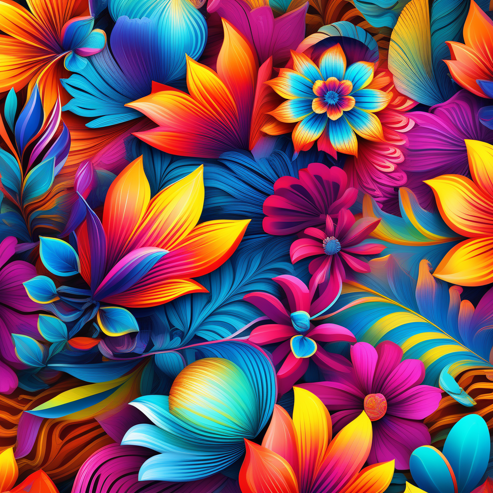
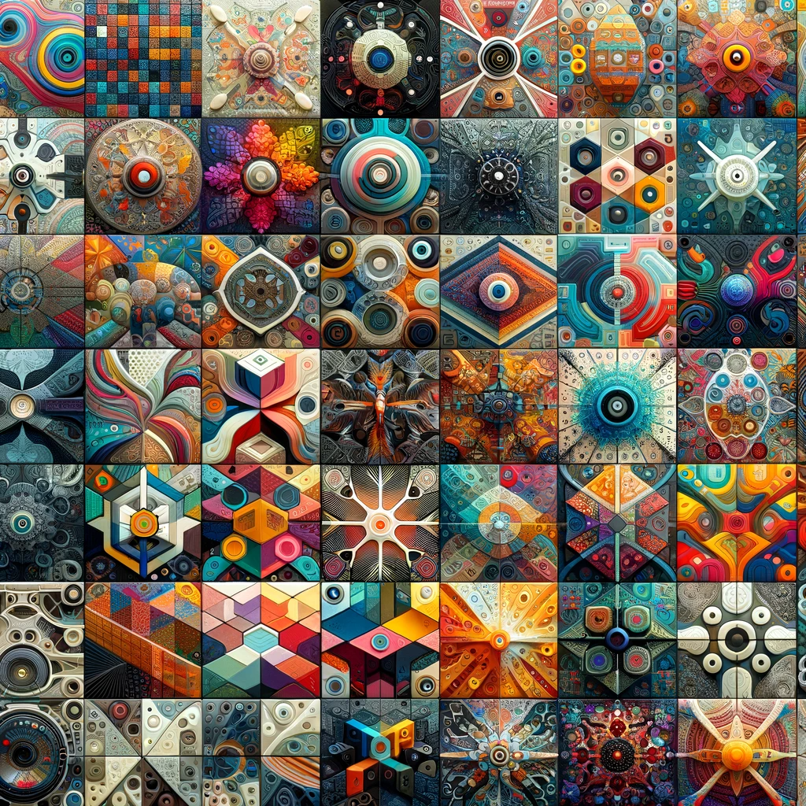

# Pattern Cafe: Crafting Unique Patterns with AI

## Summary:
Pattern Cafe is an innovative AI-driven platform that specializes in creating unique and customizable patterns. It offers an intuitive and user-friendly interface, making it a go-to solution for designers, artists, and anyone interested in pattern design. Whether for fashion, interior design, or digital art, Pattern Cafe provides a vast array of pattern styles and customization options.

## Key Points:
- AI-assisted pattern creation for various applications.
- Easy-to-use interface for all skill levels.
- Wide range of styles and customization features.

## Pros and Cons:

| Pros                                      | Cons                                    |
|-------------------------------------------|-----------------------------------------|
| Streamlines the pattern design process    | Might require a basic understanding of design principles |
| Diverse range of styles and customizations| Limited to digital format outputs       |
| Suitable for various applications         | Subscription model for full features    |

## 🌟 Tips for the Reader:
- 🎨 Experiment with different styles to find your unique pattern.
- 🖌 Customize colors and motifs to fit your project needs.
- 💡 Explore the latest trends and integrate them into your designs.

## Examples:

### Example 1: Fashion Fabric Design
- **Prompt:** Contemporary Fabric Pattern
- **Input:** Desired color scheme and style.
- **Output:** A modern pattern design for fabric printing.

### Example 2: Digital Background Creation
- **Prompt:** Abstract Digital Wallpaper
- **Input:** Abstract theme and preferred colors.
- **Output:** A unique digital background pattern.

👉 [**Try for yourself**](https://pattern.cafe/)

## URL Address of the AI Topic / vendor:
- [Pattern Cafe Official Website](https://pattern.cafe/)

---

**Follow our Social Media for more information:**
- 📘 <a href="https://www.facebook.com/groups/trionxai" target="_blank">FB group: Trionx AI Group</a>
- 👍 <a href="https://www.facebook.com/ai.trionxai" target="_blank">FB page: Trionx AI Page</a>
- 📸 <a href="https://www.instagram.com/trionxai/" target="_blank">Instagram: Trionx AI Instagram</a>
- ▶️ <a href="https://www.youtube.com/@robotdocs/" target="_blank">Youtube: Trionx AI YouTube</a>

---

## SEO High Ranking Page Tags:
Pattern Cafe, AI pattern design, digital patterns, customizable patterns, design automation, fashion design, interior design, pattern creation, artistic patterns, AI technology in design, creative patterns, pattern making, digital art, fabric patterns, wallpaper design, pattern generator, visual design, artistic creativity, style customization, textile design

