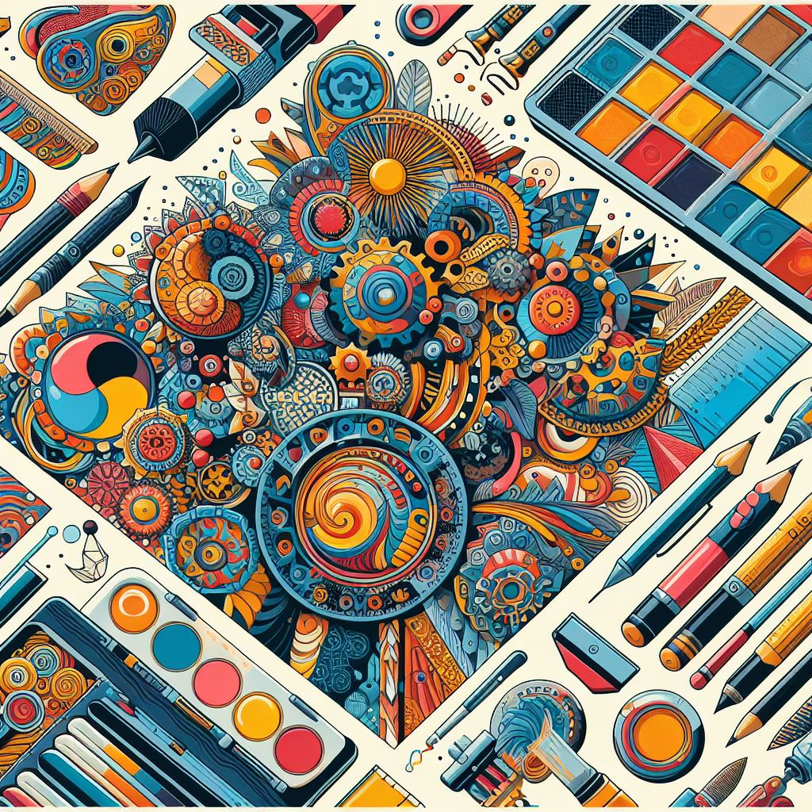

## PatternAI: Unleashing Creative Patterns with Intelligent Design

### Summary
PatternAI takes center stage as an innovative platform, unlocking the realm of creative patterns with intelligent design. This article explores the key features of PatternAI, delves into its pros and cons, provides actionable tips for users, and showcases real-world examples of how it revolutionizes pattern creation.



### Key Points
- AI-Generated Creative Patterns
- Customizable Design Elements
- Intuitive Pattern Editing Tools
- Seamless Integration into Design Workflows

### Pros and Cons

| Pros                             | Cons                                               |
| -------------------------------- | -------------------------------------------------- |
| AI-Generated Diverse Patterns     | Some Advanced Features Limited to Premium Users      |
| Customizable Design Elements      | Learning Curve for Complex Pattern Styles          |
| Intuitive Pattern Editing Tools   | Internet Connection Required for Real-Time Editing |
| Design Workflow Integration       | Premium Subscription May Be Required for Full Access|

### Tips for the Reader 💡
Maximize your PatternAI experience with these tips:
- Explore various pattern styles and customize them to match your creative vision.
- Utilize the intuitive pattern editing tools for efficient design tweaks and adjustments.
- Consider the premium features for access to an expanded library of advanced patterns.

### Examples

#### Example 1: Floral Pattern Design
**Prompt:** Designing a Floral Pattern with PatternAI

**Input:**
```dart
{
  "style": "floral",
  "elements": ["flowers", "leaves", "color palette"]
}
```

**Output:**
```dart
[AI-generated floral pattern with customizable elements and vibrant color palette]
```

#### Example 2: Geometric Pattern Exploration
**Prompt:** Exploring Geometric Patterns with PatternAI

**Input:**
```dart
{
  "style": "geometric",
  "elements": ["shapes", "lines", "symmetry"]
}
```

**Output:**
```dart
[AI-generated geometric pattern with precise shapes, lines, and symmetrical elements]
```

👉 <a href="https://www.patterned.ai/" target="_blank">Try for yourself</a>

### URL Address of the AI Topic / Vendor
<a href="https://www.patterned.ai/" target="_blank">PatternAI</a>

---

Follow our Social Media for more information:

- 📘 <a href="https://www.facebook.com/groups/trionxai" target="_blank">Facebook Group</a>
- 👍 <a href="https://www.facebook.com/ai.trionxai" target="_blank">Facebook Page</a>
- 📸 <a href="https://www.instagram.com/trionxai/" target="_blank">Instagram</a>
- ▶️ <a href="https://www.youtube.com/@robotdocs/" target="_blank">YouTube</a>

### SEO High-Ranking Page Tags
PatternAI, Creative Patterns, Intelligent Design, Customizable Elements, Pattern Editing, Design Workflow, Premium Features, Advanced Patterns