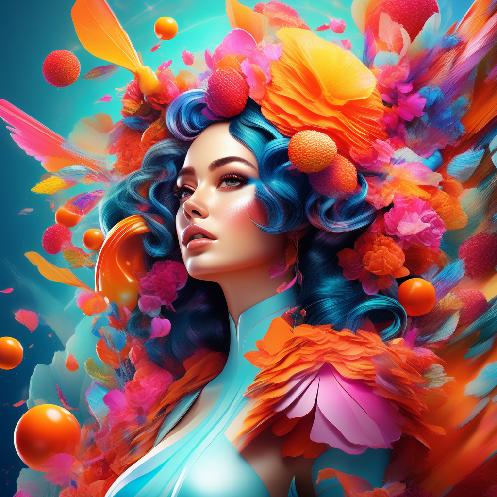

# Picsart: Unleashing Creativity with Intuitive Photo Editing

## Summary:
Picsart is a versatile and user-friendly photo editing app that empowers users to unleash their creativity. It offers a wide range of tools and features, from basic editing to advanced artistic effects, making it a popular choice for both amateurs and professionals.

## Key Points:
- Wide array of editing tools and effects.
- User-friendly interface for easy navigation.
- Supports creative expression for users of all skill levels.

## Pros and Cons:

| Pros                                   | Cons                                     |
|----------------------------------------|------------------------------------------|
| Extensive editing and design features  | Some advanced features require subscription |
| Intuitive interface suitable for beginners | High-quality edits may need practice   |
| Regular updates with new effects and tools | Some features might be overwhelming for new users |

## 🌟 Tips for the Reader:
- 🎨 Explore all the tools and effects to discover your unique style.
- 🖼️ Use high-quality images for best results.
- 💡 Follow Picsart tutorials for quick learning and inspiration.

## Examples:

### Example 1: Social Media Post Design
- **Prompt:** Eye-Catching Social Media Content
- **Input:** A basic photograph.
- **Output:** A creatively enhanced image with text and filters.

### Example 2: Artistic Photo Transformation
- **Prompt:** Artistic Makeover
- **Input:** A portrait photo.
- **Output:** A transformed image with artistic effects and overlays.

👉 <a href="https://picsart.com/" target="_blank"><b>Try for yourself</b></a>

## URL Address of Picsart:
- <a href="https://picsart.com/" target="_blank" rel="noopener noreferrer">Visit Picsart</a>

## Follow our Social Media for more information:
- 📘 <a href="https://www.facebook.com/groups/trionxai" target="_blank"><b>FB group: Trionx AI Group</b></a>
- 👍 <a href="https://www.facebook.com/ai.trionxai" target="_blank"><b>FB page: Trionx AI Page</b></a>
- 📸 <a href="https://www.instagram.com/trionxai/" target="_blank"><b>Instagram: Trionx AI Instagram</b></a>
- ▶️ <a href="https://www.youtube.com/@robotdocs/" target="_blank"><b>Youtube: Trionx AI YouTube</b></a>

## SEO High Ranking Page Tags:
Picsart, photo editing, creative design, image enhancement, photo effects, digital art, mobile editing app, graphic design, photography, artistic filters, editing tutorials, visual content, social media graphics, image transformation, photo overlays, creative expression, user-friendly interface, design tools, visual creativity, digital imagery

