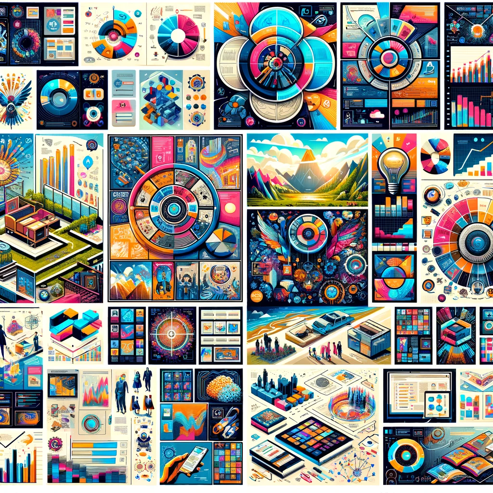

# Piktochart AI: Transforming Visual Communication

## Summary:
Piktochart AI is an innovative tool that harnesses the power of artificial intelligence to streamline and enhance the process of creating engaging visual content. It's designed to cater to the needs of marketers, educators, and content creators, offering an intuitive platform for generating infographics, presentations, and reports with ease.

,

## Key Points:
- AI-powered graphic design and data visualization.
- User-friendly interface suitable for all skill levels.
- A versatile tool for various content creation needs.

## Pros and Cons:

| Pros                                        | Cons                                     |
|---------------------------------------------|------------------------------------------|
| Simplifies complex design processes         | Limited customization in AI-generated elements |
| Wide variety of templates and design options| Reliance on AI may restrict unique creativity |
| Time-saving and efficient                   | Internet dependency for full functionality |

## 🌟 Tips for the Reader:
- 💡 Use Piktochart AI for quick data visualization projects.
- 🎨 Explore different templates to find the perfect fit for your content.
- 📊 Utilize AI suggestions for layout and design optimization.

## Examples:

### Example 1: Engaging Infographic Creation
- **Prompt:** Data-Driven Infographic for Social Media
- **Input:** Key statistics and desired themes.
- **Output:** A visually appealing infographic optimized for social media sharing.

### Example 2: Interactive Presentation Design
- **Prompt:** Educational Presentation for Online Learning
- **Input:** Educational content and desired learning outcomes.
- **Output:** An interactive and educational presentation tailored for online learners.

👉 [**Try for yourself**](https://piktochart.com/generative-ai/)

## URL Address of the AI Topic / vendor:
- [Piktochart AI Official Website](https://piktochart.com/generative-ai/)

---

**Follow our Social Media for more information:**
- 📘 <a href="https://www.facebook.com/groups/trionxai" target="_blank">FB group: Trionx AI Group</a>
- 👍 <a href="https://www.facebook.com/ai.trionxai" target="_blank">FB page: Trionx AI Page</a>
- 📸 <a href="https://www.instagram.com/trionxai/" target="_blank">Instagram: Trionx AI Instagram</a>
- ▶️ <a href="https://www.youtube.com/@robotdocs/" target="_blank">Youtube: Trionx AI YouTube</a>

---

## SEO High Ranking Page Tags:
Piktochart AI, visual communication, AI in design, infographic creation, presentation design, AI graphic design, data visualization, content creation tools, automated design, marketing visuals, educational infographics, social media graphics, Piktochart templates, AI creativity, visual content, design efficiency, creative infographics, AI design tools, presentation templates, AI-generated visuals

