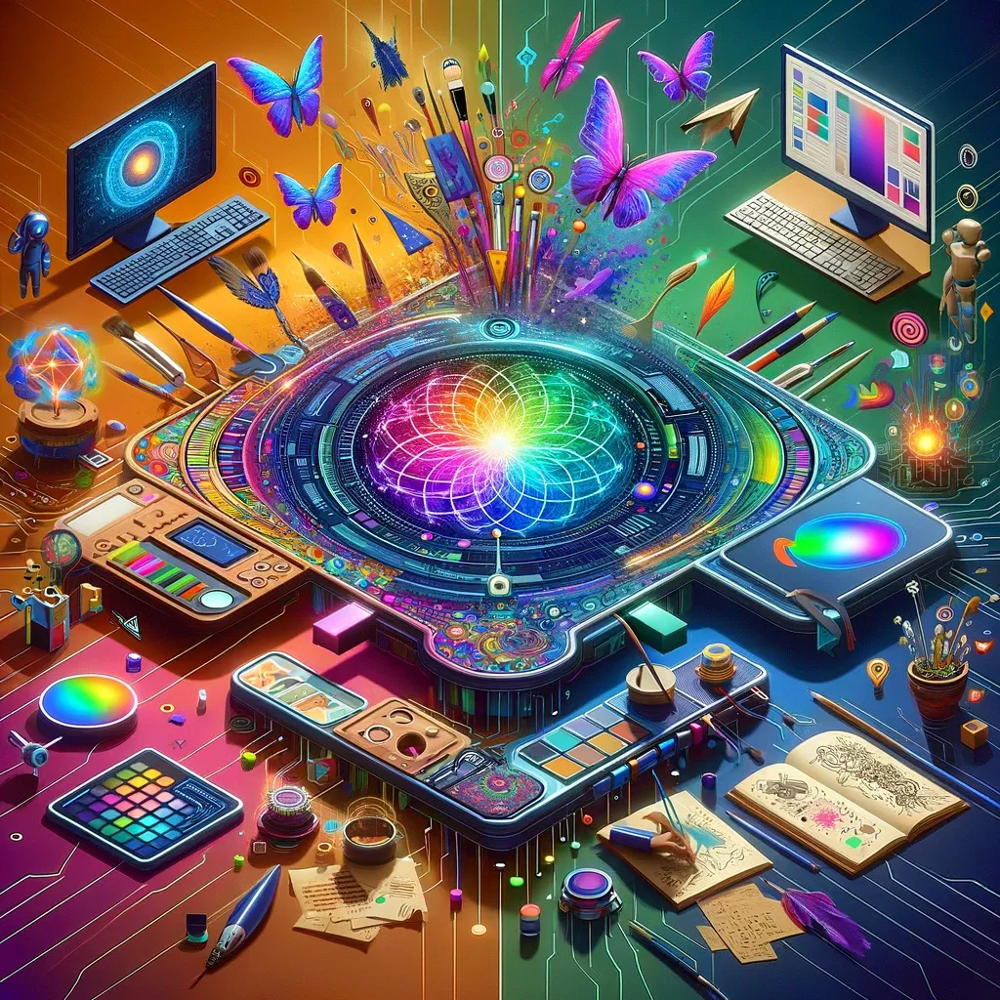
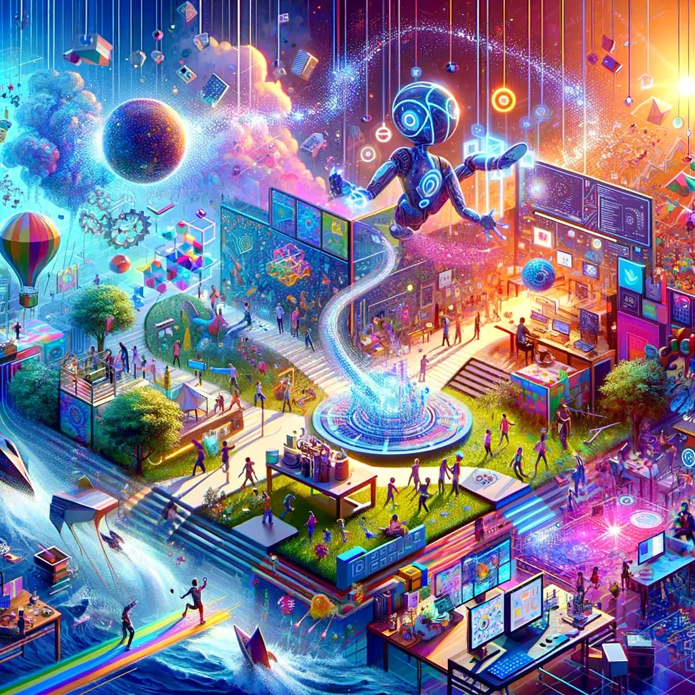

# Playground AI: Unleashing Creativity with Artificial Intelligence

## Summary:
Playground AI is an innovative platform that offers a playground for creativity through AI. It provides tools and environments where users, from amateurs to experts, can experiment with various AI technologies. From machine learning models to neural networks, Playground AI is a hub for exploring, learning, and creating with AI.

## Key Points:
- Offers a variety of AI tools and technologies.
- User-friendly interface for all skill levels.
- Facilitates learning and experimentation in AI.

## Pros and Cons:

| Pros                              | Cons                                   |
|-----------------------------------|----------------------------------------|
| Wide range of AI tools            | Might be overwhelming for beginners    |
| Intuitive and user-friendly       | Requires internet connection          |
| Encourages creativity and learning| Limited to the tools available on the platform |

## 🌟 Tips for the Reader:
- 🤖 Start with simple projects to get a feel for the platform.
- 📚 Utilize available tutorials and resources to enhance learning.
- 💡 Experiment with different tools to discover their full potential.

🔵 **Maximize your AI exploration with these tips at Playground AI!**

## Examples:

### Example 1: AI-Generated Art
- **Prompt:** Exploring AI in Art
- **Input:** Basic sketches or patterns.
- **Output:** Complex, AI-generated artistic interpretations.

### Example 2: Machine Learning Models
- **Prompt:** Machine Learning Experimentation
- **Input:** Data sets for training models.
- **Output:** Trained models and analysis results.

👉 **[Try for yourself](<https://playgroundai.com/>)**

**Dive into the world of AI with Playground AI!**

## URL Address of Playground AI:
- [Playground AI Official Site](<https://playgroundai.com/>)

---

## Follow our Social Media for more information

- 📘 <a href="https://www.facebook.com/groups/trionxai" target="_blank">FB group: Trionx AI Group</a>
- 👍 <a href="https://www.facebook.com/ai.trionxai" target="_blank">FB page: Trionx AI Page</a>
- 📸 <a href="https://www.instagram.com/trionxai/" target="_blank">Instagram: Trionx AI Instagram</a>
- ▶️ <a href="https://www.youtube.com/@robotdocs/" target="_blank">Youtube: Trionx AI YouTube</a>

## SEO High Ranking Page Tags:
Playground AI, artificial intelligence, AI tools, machine learning, neural networks, AI creativity, AI learning platform, technology exploration, AI experimentation, user-friendly AI, AI for beginners, AI projects, AI art, data science, machine learning models, AI development, tech creativity, AI education, digital innovation, AI exploration

