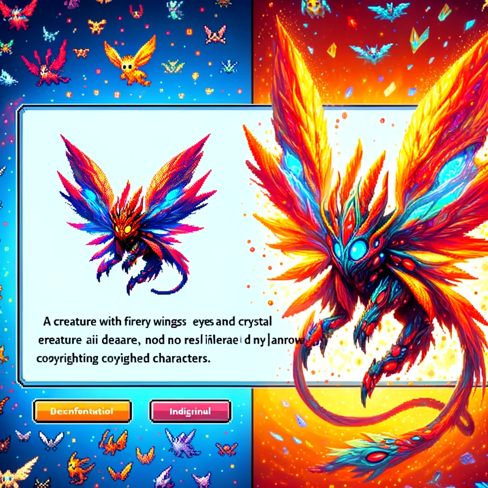
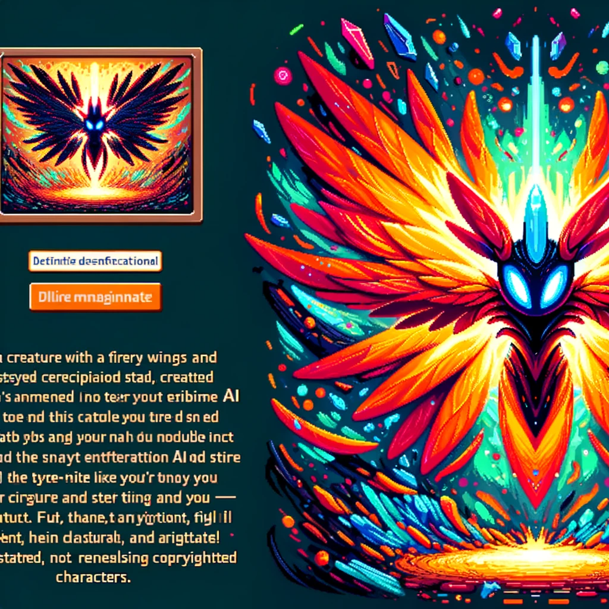
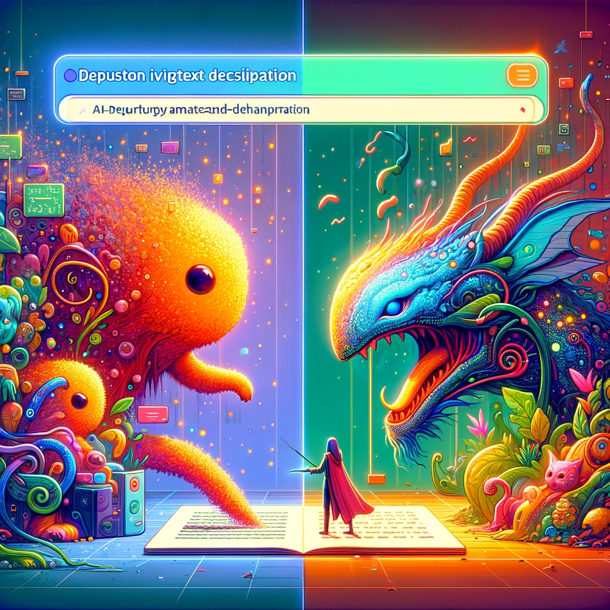

# Text-To-Pokemon: Unleashing Creativity in the World of AI and Pokémon

## Summary:
Text-To-Pokemon is a unique AI-driven tool that allows users to generate Pokémon characters based on textual descriptions. Combining the fun of Pokémon with the innovation of AI, this tool translates descriptive text into vivid Pokémon images, providing a creative outlet for both Pokémon enthusiasts and AI hobbyists.

## Key Points:
- AI-powered Pokémon character generation.
- Translates text descriptions into Pokémon images.
- Engaging for Pokémon fans and AI enthusiasts.

## Pros and Cons:

| Pros                                   | Cons                                    |
|----------------------------------------|-----------------------------------------|
| Encourages creativity and imagination  | Outputs may vary from expected results   |
| Easy to use interface                  | Limited to the realm of Pokémon characters |
| Fun way to explore AI capabilities     | Requires understanding of Pokémon traits |

## 🌟 Tips for the Reader:
- 🐾 Be as descriptive as possible in your text inputs.
- 🎨 Experiment with different descriptions to see diverse results.
- 🤖 Learn about Pokémon traits to create more accurate representations.

🔵 **Experience the magic of Pokémon creation with Text-To-Pokemon!**

## Examples:

### Example 1: Creating a Fire-Type Pokémon
- **Prompt:** Fiery and Fierce
- **Input:** "A Pokémon with flaming tail and fiery mane."
- **Output:** Image of a Pokémon embodying the fiery description.

### Example 2: Designing a Water-Type Pokémon
- **Prompt:** Aquatic Adventurer
- **Input:** "A water-type Pokémon resembling a dolphin with aquatic powers."
- **Output:** Generated image of a water-themed Pokémon.

👉 **[Try for yourself](https://www.futuretools.io/tools/text-to-pokemon)**

**Dive into the world of AI-powered Pokémon creation!**

## URL Address of Text-To-Pokemon:
- [Text-To-Pokemon Official Site](https://www.futuretools.io/tools/text-to-pokemon)

---

## Stay Informed and Connected:

- 📘 FB group: [Join Our Facebook Group](https://www.facebook.com/groups/trionxai)
- 📖 FB page: [Like Our Facebook Page](https://www.facebook.com/ai.trionxai)
- 📸 Instagram: [Follow Us on Instagram](https://www.instagram.com/trionxai/)
- 📹 Youtube: [Subscribe to Our YouTube Channel](https://www.youtube.com/@robotdocs/)

## SEO High Ranking Page Tags:
Text-To-Pokemon, AI Pokémon generation, Pokémon characters, AI creativity, Pokémon images, AI and gaming, Pokémon design, AI tools, fun AI applications, character generation, AI image synthesis, Pokémon fans, AI enthusiasts, imaginative AI, Pokémon creations, digital Pokémon, AI-generated characters, gaming and AI, Pokémon world, creative AI technology

---

*Image Prompt for Dall-E 3: "An imaginative representation of the Text-To-Pokemon interface showing the transformation of a text description into a vibrant and unique AI-generated Pokémon character, depicted in a fun and colorful digital art style."*

