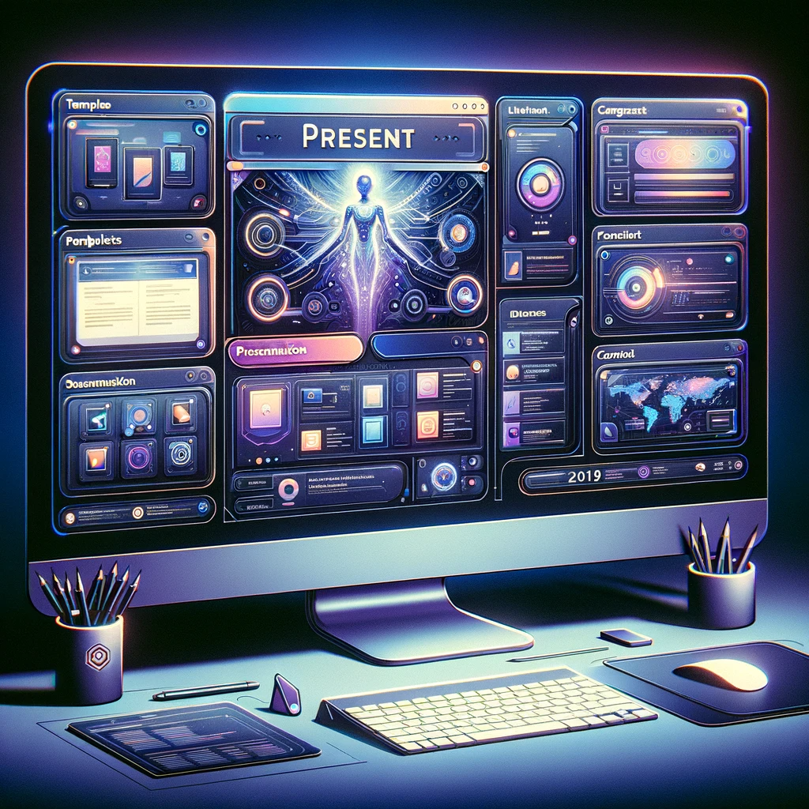
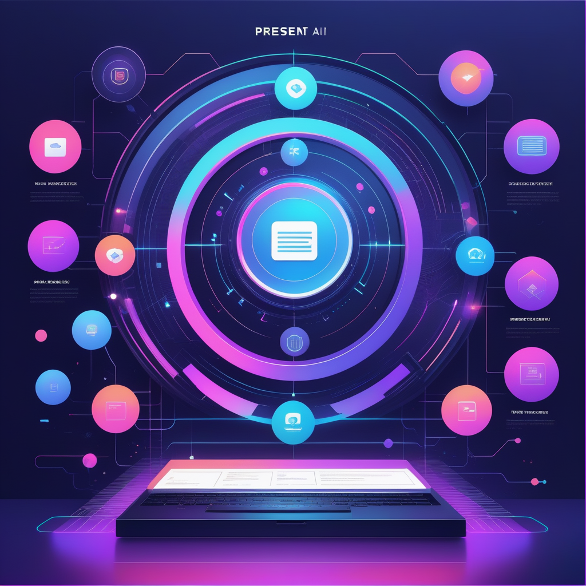

# Present AI: Revolutionizing Presentation Creation with AI

## Summary:
Present AI is an innovative tool designed to transform the way presentations are created, using advanced artificial intelligence. It streamlines the process of presentation design, content organization, and delivery, making it easier for users to create professional and effective presentations.

## Key Points:
- AI-driven content organization and design suggestions.
- Real-time speech analysis for effective delivery.
- User-friendly interface for easy navigation and use.

## Pros and Cons:

| Pros                                    | Cons                                      |
|-----------------------------------------|-------------------------------------------|
| Simplifies the presentation creation process | May require a subscription for full features |
| Offers creative design templates        | Limited customizability in some templates  |
| Provides real-time feedback for improvement | Relies on AI's understanding of content   |

## 🌟 Tips for the Reader:
- 🎯 Focus on your main message and let Present AI organize your content.
- 🎨 Use AI-suggested templates to enhance visual appeal.
- 🗣 Practice your presentation with AI feedback to refine delivery.

## Examples:

### Example 1: Business Proposal
- **Prompt:** Convincing Business Pitch
- **Input:** Key points of a business proposal.
- **Output:** Well-structured and visually appealing presentation.

### Example 2: Academic Lecture
- **Prompt:** Engaging Academic Presentation
- **Input:** Outline of an academic lecture.
- **Output:** Educational presentation with relevant visuals and layouts.

### 👉 [Try for yourself](<https://presentai.org/>)

### URL Address of the AI Topic / Vendor
### [Insert Vendor URL Here](<https://presentai.org/>)

### Follow our Social Media for more information
- 📘 [FB group: Trionx AI Group](https://www.facebook.com/groups/trionxai){:target="_blank"}
- 👍 [FB page: Trionx AI Page](https://www.facebook.com/ai.trionxai){:target="_blank"}
- 📸 [Instagram: Trionx AI Instagram](https://www.instagram.com/trionxai/){:target="_blank"}
- ▶️ [Youtube: Trionx AI YouTube](https://www.youtube.com/@robotdocs/){:target="_blank"}

## SEO High Ranking Page Tags:
Present AI, AI presentation, effective presentations, business pitches, academic lectures, presentation design, AI tools, professional slides, presentation software, AI technology, public speaking, content organization, visual design, presentation templates, speech analysis, business communication, educational technology, creative presentations, digital tools, AI enhancements

