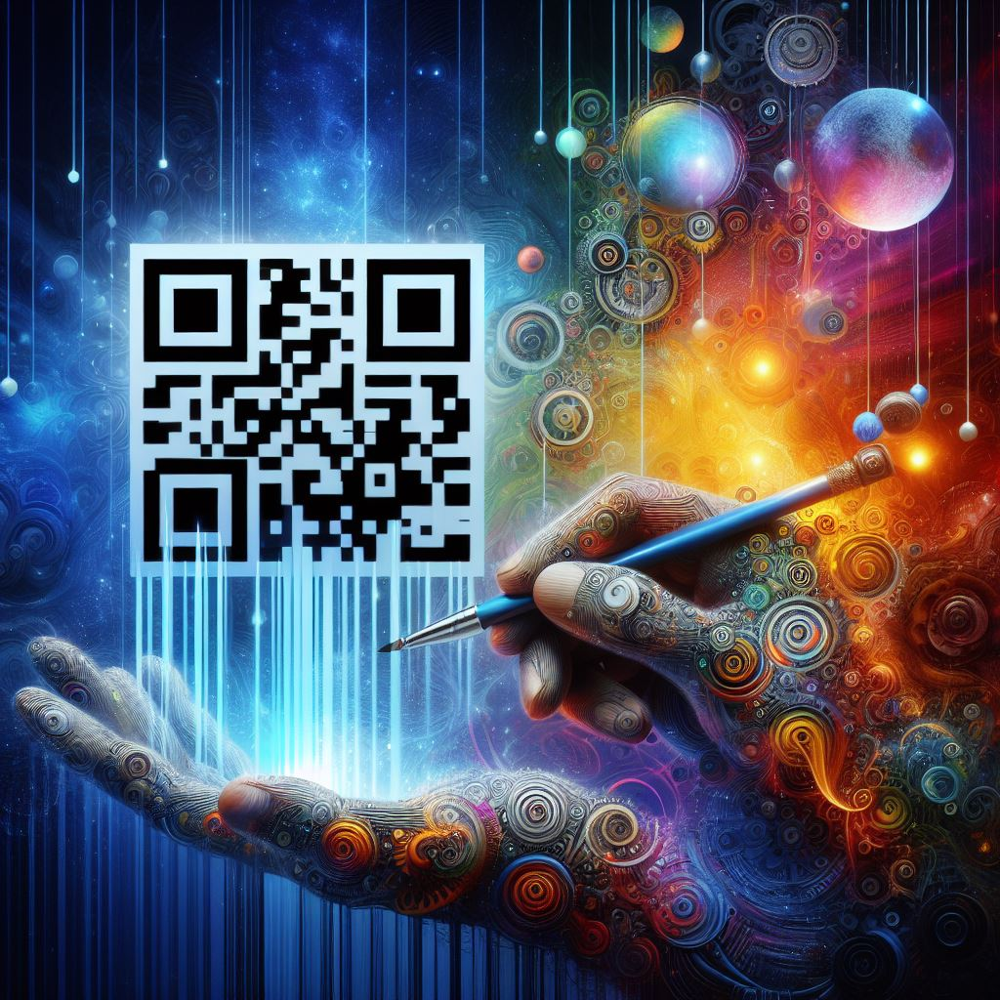

## Unlocking Creativity: QR Code AI Art Generator's Innovative Intersection of Technology and Artistry

### Summary
The QR Code AI Art Generator represents the fusion of technology and artistic expression. This article delves into how this pioneering tool harnesses AI to metamorphose QR codes into visually compelling and personalized artworks.



### Key Points

1. **Introduction to QR Code AI Art Generator:** Unveiling the distinct amalgamation of QR code functionality and artistic ingenuity driven by AI.
2. **Artistic Transformation of QR Codes:** Spotlighting the process of utilizing AI to convert QR codes into aesthetically appealing artworks.
3. **Pros and Cons** (Table Format):

| Pros                                 | Cons                                |
|--------------------------------------|-------------------------------------|
| Fuses technology with artistic expression | Complexity in intricate design rendering|
| Personalized and visually appealing artworks | Varied QR code scanning reliability |
| Enhances QR code engagement            | Limited design compatibility with some scanners|

### Tips for the Reader 💡
Enhance QR Codes with Artistic Flair:
- Experiment with various design styles for unique QR code artworks.
- Consider the compatibility of the design with different scanning environments.
- Utilize personalized QR code art to creatively engage audiences.

### Examples

#### Example 1: Custom QR Code Artwork
**Prompt:** Generating Personalized QR Code Art

**Input**
```dart
QR_art = QR_code_AI_generator.generate("Personalized message")
```

**Output**
```dart
A visually appealing QR code artwork with the embedded message.
```

#### Example 2: Dynamic QR Code Art Composition
**Prompt:** Creating Dynamic QR Code Artwork

**Input**
```dart
dynamic_art = QR_code_AI_generator.generate_dynamic("Interactive content")
```

**Output**
```dart
An interactive and visually engaging QR code artwork showcasing dynamic elements.
```

#### Example 3: Brand Integration with QR Code Art
**Prompt:** Designing Branded QR Code Artwork

**Input**
```dart
brand_art = QR_code_AI_generator.generate_brand("Company logo and information")
```

**Output**
```dart
A branded QR code artwork seamlessly embedding company information and logo.
```

Try for Yourself 👉 <a href="https://huggingface.co/spaces/huggingface-projects/QR-code-AI-art-generator" target="_blank">Explore QR Code AI Art Generator</a>

## URL Address
- <a href="https://huggingface.co/spaces/huggingface-projects/QR-code-AI-art-generator" target="_blank">QR Code AI Art Generator</a>

### Follow our Social Media for more information:
- 📘 <a href="https://www.facebook.com/groups/trionxai" target="_blank">Facebook Group: Trionxai</a>
- 👍 <a href="https://www.facebook.com/ai.trionxai" target="_blank">Facebook Page: AI Trionxai</a>
- 📸 <a href="https://www.instagram.com/trionxai/" target="_blank">Instagram: Trionxai</a>
- ▶️ <a href="https://www.youtube.com/@robotdocs/" target="_blank">Youtube: Robotdocs</a>

<hr>

### SEO High Ranking Page Tags
AI, QR Code, QR Code Art, AI Art Generator, Artistic QR Codes, AI Technology, Creative QR Code, QR Code Design, QR Code Innovation, AI-Generated Art, QR Code Aesthetics, QR Code Personalization, AI and Art, QR Code Applications, AI Advancements