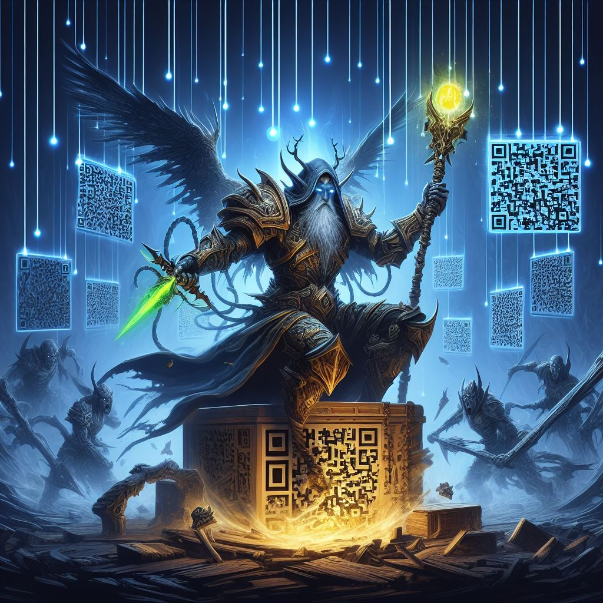

## QRCraft: Revolutionizing QR Code Generation with AI-Powered Innovations

### Summary
QRCraft.xyz emerges as an innovative platform integrating AI to redefine QR code generation. This article explores how QRCraft leverages AI algorithms to enhance QR code customization and functionality.



### Key Points

1. **Introduction to QRCraft:** Unveiling QRCraft.xyz's role in utilizing AI for advanced QR code generation and customization.
2. **AI's Role in QR Code Generation:** Exploring how QRCraft employs AI-driven algorithms for personalized and enhanced QR code functionalities.
3. **Pros and Cons** (Table Format):

| Pros                                 | Cons                                |
|--------------------------------------|-------------------------------------|
| Personalized and versatile QR codes   | Complexity in intricate designs     |
| Enhanced QR code functionality       | Compatibility issues with some scanners |
| AI-driven QR code customization      | Potential data privacy concerns     |

### Tips for the Reader 💡
Enhancing QR Code Usage with QRCraft:
- Experiment with diverse QR code customization options for various functionalities.
- Validate QR code compatibility across different scanning environments.
- Address privacy concerns related to QR code data if applicable.

### Examples

#### Example 1: Customized QR Code Generation
**Prompt:** Generating Custom QR Codes Using QRCraft

**Input**
```dart
custom_qr_code = QRCraft.generate_custom_code(data, customization)
```

**Output**
```dart
Personalized QR code generated with specified data and customization using QRCraft's AI-powered tools.
```

#### Example 2: Enhanced Functionality QR Codes
**Prompt:** Creating Functional QR Codes with QRCraft

**Input**
```dart
functional_qr_code = QRCraft.generate_functional_code(function, parameters)
```

**Output**
```dart
QR code designed with specific functionalities and parameters, enhancing its usage via QRCraft's AI capabilities.
```

#### Example 3: Dynamic QR Code Creation
**Prompt:** Generating Dynamic QR Codes Using QRCraft

**Input**
```dart
dynamic_qr_code = QRCraft.generate_dynamic_code(content)
```

**Output**
```dart
A dynamic QR code crafted to adapt and change content, reflecting the latest updates via QRCraft's AI-driven features.
```

Try for Yourself 👉 <a href="https://www.qrcraft.xyz" target="_blank">Explore QRCraft</a>

## URL Address
- <a href="https://www.qrcraft.xyz" target="_blank">QRCraft - AI-Powered QR Code Generation</a>

### Follow our Social Media for more information:
- 📘 <a href="https://www.facebook.com/groups/trionxai" target="_blank">Facebook Group: Trionxai</a>
- 👍 <a href="https://www.facebook.com/ai.trionxai" target="_blank">Facebook Page: AI Trionxai</a>
- 📸 <a href="https://www.instagram.com/trionxai/" target="_blank">Instagram: Trionxai</a>
- ▶️ <a href="https://www.youtube.com/@robotdocs/" target="_blank">Youtube: Robotdocs</a>

<hr>

### SEO High Ranking Page Tags
AI, QRCraft, QR Code Generation, AI-Driven QR Codes, Personalized QR Codes, QR Code Customization, Artificial Intelligence, QR Code Functionality, Dynamic QR Codes, AI Applications, QR Code Innovations, AI Advancements