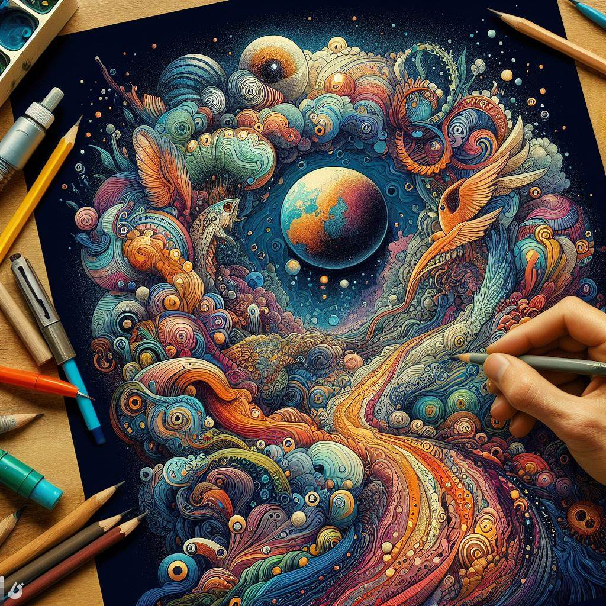

## Unleashing Creativity: A Deep Dive into Scribble Diffusion's Artistic Realm

### Summary
Scribble Diffusion emerges as a unique platform redefining digital art creation. This article explores its key features, outlines pros and cons, provides valuable tips, and showcases real-world examples illustrating the artistic potential of Scribble Diffusion.



### Key Points
- Innovative Artistic Expression
- User-Friendly Interface
- Collaborative Art Projects
- Diverse Creative Tools

### Pros and Cons

| Pros                        | Cons                         |
|-----------------------------|------------------------------|
| Innovative Art Techniques   | Limited Tutorials            |
| Intuitive User Interface    | Premium Features Cost        |
| Collaborative Art Projects  | Limited Export Options       |
| Diverse Creative Tools      | Internet Connection Required |

### Tips for the Reader 💡
Enhance your Scribble Diffusion experience with these tips:
- Experiment with various brushes and textures to discover unique artistic styles.
- Collaborate with other artists on the platform to create inspiring joint projects.
- Save your work regularly, as some features may require a premium subscription.

### Examples

#### Example 1: Abstract Art Creation
**Prompt:** Expressive Abstract Art with Scribble Diffusion

**Input:**
```dart
import scribble_diffusion

canvas = scribble_diffusion.create_canvas('AbstractExpression')
scribble_diffusion.apply_brush(canvas, 'swirl', color='blue')
```

**Output:**
```dart
Abstract masterpiece created: Swirling patterns in vibrant blue hues.
```

#### Example 2: Collaborative Mural
**Prompt:** Collaborative Mural Project on Scribble Diffusion

**Input:**
```dart
import scribble_diffusion

project = scribble_diffusion.create_collaborative_project('MuralMadness')
scribble_diffusion.invite_collaborators(project, ['artist1', 'artist2'])
```

**Output:**
```dart
Collaborative mural project initiated: Artists contributing to a shared canvas.
```

👉 <a href="https://scribblediffusion.com/" target="_blank">Try for yourself</a>

### URL Address of the AI Topic / Vendor
<a href="https://scribblediffusion.com/" target="_blank">Scribble Diffusion</a>

---

Follow our Social Media for more information:

- 📘 <a href="https://www.facebook.com/groups/trionxai" target="_blank">Facebook Group</a>
- 📄 <a href="https://www.facebook.com/ai.trionxai" target="_blank">Facebook Page</a>
- 📸 <a href="https://www.instagram.com/trionxai/" target="_blank">Instagram</a>
- 🎥 <a href="https://www.youtube.com/@robotdocs/" target="_blank">YouTube</a>

### SEO High-Ranking Page Tags
Scribble Diffusion, Digital Art Creation, Innovative Art Techniques, Collaborative Art, Creative Tools, Artistic Expression, Artistic Styles, Premium Features, Creative Projects, Art Examples