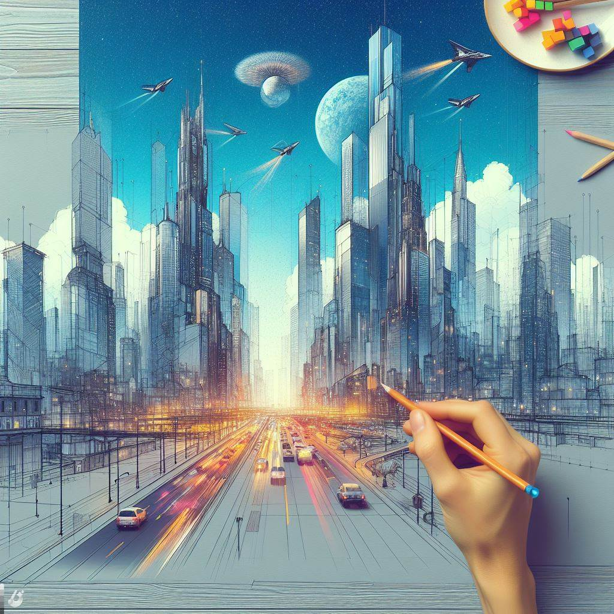

## Sketch2Render: Bridging Sketches to Reality with AI Rendering

### Summary
Sketch2Render emerges as a revolutionary tool, bridging the gap between sketches and reality through advanced AI rendering. This article explores the key features of Sketch2Render, unveils its pros and cons, offers practical tips for users, and showcases real-world examples of how it transforms conceptual sketches into visually stunning renditions.



### Key Points
- AI-Powered Rendering for Conceptual Sketches
- Realistic Visualizations for Design Concepts
- Intuitive User Interface for Seamless Workflow
- Cross-Platform Compatibility

### Pros and Cons

| Pros                             | Cons                                               |
| -------------------------------- | -------------------------------------------------- |
| Advanced AI Rendering Capabilities| Some Advanced Features Limited to Premium Users      |
| Realistic Visualizations          | Learning Curve for Complex Rendering Styles        |
| Intuitive User Interface          | Internet Connection Required for Real-Time Rendering|
| Cross-Platform Compatibility      | Premium Subscription May Be Required for Full Access|

### Tips for the Reader 💡
Maximize your Sketch2Render experience with these tips:
- Experiment with various rendering styles to match the desired visual aesthetic.
- Utilize the intuitive user interface for efficient navigation and customization.
- Explore premium features for access to advanced rendering techniques.

### Examples

#### Example 1: Architectural Concept Visualization
**Prompt:** Visualizing Architectural Concepts with Sketch2Render

**Input:**
```dart
{
  "style": "modern",
  "elements": ["building exterior", "interior spaces", "natural lighting"]
}
```

**Output:**
```dart
[Realistic visualization of an architectural concept with modern styling]
```

#### Example 2: Product Design Concept Rendering
**Prompt:** Rendering a Product Design Concept with Sketch2Render

**Input:**
```dart
{
  "style": "sleek",
  "elements": ["product details", "material finishes", "dynamic lighting"]
}
```

**Output:**
```dart
[Rendered product design concept with sleek styling and dynamic lighting]
```

👉 <a href="https://exp.graymatter.ai/" target="_blank">Try for yourself</a>

### URL Address of the AI Topic / Vendor
<a href="https://exp.graymatter.ai/" target="_blank">Sketch2Render</a>

---

Follow our Social Media for more information:

- 📘 <a href="https://www.facebook.com/groups/trionxai" target="_blank">Facebook Group</a>
- 👍 <a href="https://www.facebook.com/ai.trionxai" target="_blank">Facebook Page</a>
- 📸 <a href="https://www.instagram.com/trionxai/" target="_blank">Instagram</a>
- ▶️ <a href="https://www.youtube.com/@robotdocs/" target="_blank">YouTube</a>

### SEO High-Ranking Page Tags
Sketch2Render, AI Rendering, Conceptual Sketches, Visualizations, Design Concepts, Intuitive User Interface, Premium Features, Rendering Techniques