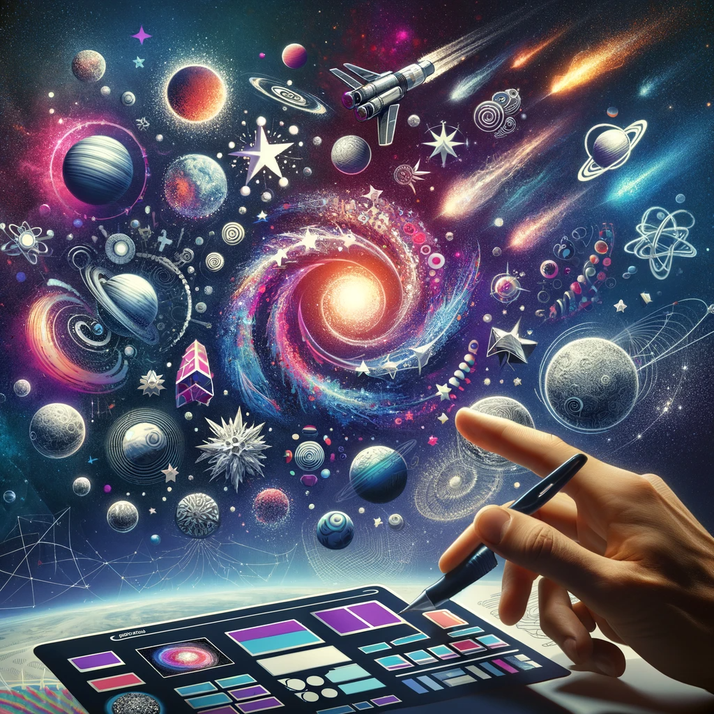

# Space Logo: Crafting the Future of Branding

## Summary:
Space Logo is an innovative AI-powered logo creation platform specializing in space-themed designs. It's tailored for businesses and individuals seeking unique, futuristic branding elements. The platform offers a user-friendly experience, enabling users to generate distinctive logos inspired by space and astronomical themes.

## Key Points:
- AI-driven space-themed logo creation.
- Intuitive design process for users of all skill levels.
- Customizable templates with a futuristic aesthetic.

## Pros and Cons:

| Pros                                       | Cons                                        |
|--------------------------------------------|---------------------------------------------|
| Unique space-themed logo designs           | Limited to space-related aesthetics         |
| Quick and easy logo generation             | May require fine-tuning for specific needs   |
| High-quality graphics suitable for various uses | Some features may require a premium subscription |

## 🌟 Tips for the Reader:
- 🌌 Experiment with different space elements for a unique logo.
- 💫 Use high-contrast colors for more impactful designs.
- 🛸 Try combining multiple astronomical features for complexity.

## Examples:

### Example 1: Tech Startup Branding
- **Prompt:** Futuristic and Innovative
- **Input:** Company name and theme of technology and innovation.
- **Output:** A sleek, space-themed logo reflecting modern innovation.

### Example 2: Astronomy Blog Logo
- **Prompt:** Celestial Exploration
- **Input:** Blog name with an emphasis on star-gazing and celestial events.
- **Output:** A vibrant logo featuring stars, planets, and telescopes.

👉 [**Try for yourself**](https://www.logoai.com/logo/space){:target="_blank"} AND [**Logo Maker**](https://logomakerr.ai/logo/space){:target="_blank"}

## URL Address of the AI Topic / vendor:
- [Space Logo - LogoAI](https://www.logoai.com/logo/space){:target="_blank"}
- [Space Logo - LogoMaker](https://logomakerr.ai/logo/space){:target="_blank"}

---

**Follow our Social Media for more information:**
- 📘 <a href="https://www.facebook.com/groups/trionxai" target="_blank">FB group: Trionx AI Group</a>
- 👍 <a href="https://www.facebook.com/ai.trionxai" target="_blank">FB page: Trionx AI Page</a>
- 📸 <a href="https://www.instagram.com/trionxai/" target="_blank">Instagram: Trionx AI Instagram</a>
- ▶️ <a href="https://www.youtube.com/@robotdocs/" target="_blank">Youtube: Trionx AI YouTube</a>

---

## SEO High Ranking Page Tags:
Space Logo, AI logo design, space branding, futuristic logos, astronomical themes, logo creation, branding solutions, AI technology, graphic design, space aesthetics, logo templates, digital branding, custom logos, business identity, creative design, logo generator, space-inspired logos, visual branding, marketing design, innovative logos

---

*Image Prompt for Dall-E 3: "A visually captivating representation of the Space Logo platform, illustrating the process of transforming space-inspired themes into unique and modern logos, showcased in a creative and futuristic digital art style."*

