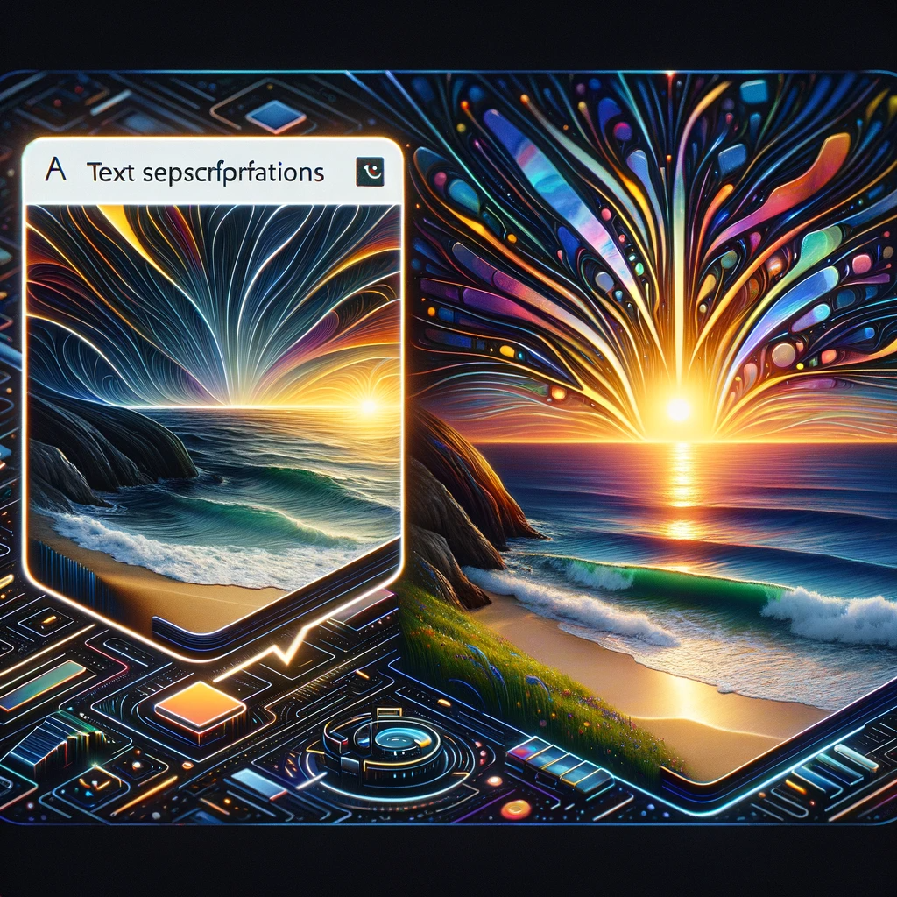

# StockImg AI: Revolutionizing Stock Photography with Artificial Intelligence

## Summary:
StockImg AI is an innovative platform that leverages AI to revolutionize the stock photography industry. It offers users the ability to create and customize stock images using AI, providing a vast array of options that cater to diverse needs. This tool is ideal for marketers, designers, and content creators looking for unique and tailored imagery.

## Key Points:
- AI-driven creation and customization of stock images.
- Wide variety of styles and themes.
- User-friendly interface for ease of use.

## Pros and Cons:

| Pros                                  | Cons                                 |
|---------------------------------------|--------------------------------------|
| High-quality, unique image generation | May require specific inputs for best results |
| Time-saving for quick image creation  | Limited to the styles available in AI algorithms |
| Easy to use for non-professionals     | Potential learning curve for complex customizations |

## 🌟 Tips for the Reader:
- 🎨 Experiment with different styles and inputs to find the best results.
- 🖼️ Use specific and detailed descriptions for more accurate image generation.
- 💡 Keep up with updates to the platform for new features and styles.

## Examples:

### Example 1: Marketing Campaign Imagery
- **Prompt:** Creative Ad Visuals
- **Input:** Description of desired marketing theme and elements.
- **Output:** Customized stock image fitting the marketing campaign.

### Example 2: Blog Post Illustrations
- **Prompt:** Engaging Blog Graphics
- **Input:** Blog topic and preferred style.
- **Output:** Unique and relevant images for blog posts.

👉 [**Try for yourself**](<https://stockimg.ai/>){:target="_blank"}

## URL Address of StockImg AI:
- [StockImg AI Official Site](https://stockimg.ai/){:target="_blank"}

---

**Follow our Social Media for more information:**
- 📘 [FB group: Trionx AI Group](https://www.facebook.com/groups/trionxai){:target="_blank"}
- 👍 [FB page: Trionx AI Page](https://www.facebook.com/ai.trionxai){:target="_blank"}
- 📸 [Instagram: Trionx AI Instagram](https://www.instagram.com/trionxai/){:target="_blank"}
- ▶️ [Youtube: Trionx AI YouTube](https://www.youtube.com/@robotdocs/){:target="_blank"}

---

## SEO High Ranking Page Tags:
StockImg AI, AI stock photography, image generation, AI in design, custom stock images, AI technology, digital marketing, content creation, artificial intelligence, visual content, stock photos, AI customization, graphic design, creative imagery, photography innovation, AI tools, marketing visuals, blog illustrations, AI-driven imagery, stock photo creation

*Image Prompt for Dall-E 3: "An artistic depiction of the StockImg AI platform in action, illustrating the process of transforming text descriptions into vibrant, AI-generated stock images, presented in a sleek and futuristic digital art style."*

