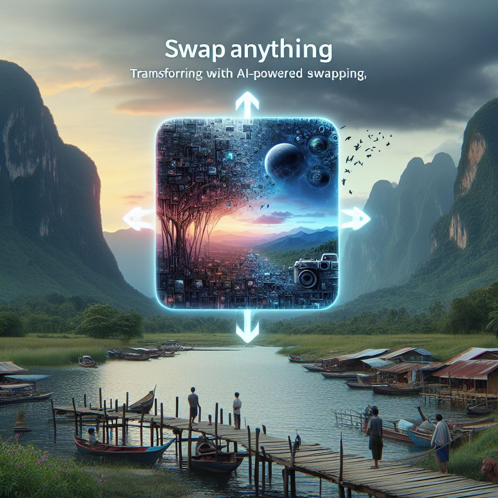

## Swap Anything: Transforming Images with AI-Powered Swapping

### Summary
Swap Anything, available at imgcreator.zmo.ai, introduces an innovative platform that harnesses AI for image transformation. This article explores how Swap Anything uses advanced AI algorithms to revolutionize image swapping, enabling users to seamlessly transform various elements within images.



### Key Points

1. **Introduction to Swap Anything:** Unveiling imgcreator.zmo.ai's role in revolutionizing images through AI-powered swapping innovations.
2. **AI's Role in Image Transformation:** Exploring how Swap Anything leverages AI for the seamless swapping of image elements.
3. **Pros and Cons** (Table Format):

| Pros                                 | Cons                                |
|--------------------------------------|-------------------------------------|
| Versatile image swapping capabilities | Learning curve for new users        |
| Diverse elements for swapping        | Dependency on predefined models     |
| Simplifies complex image alteration  | Variability in output quality       |

### Tips for the Reader 💡
Exploring Image Swapping with Swap Anything:
- Experiment with various image swapping tools available on the platform to grasp its capabilities.
- Engage with tutorials and community resources to unlock the full potential of Swap Anything's AI-driven tools.
- Utilize diverse images to effectively leverage the platform's image swapping capabilities.

### Examples

#### Example 1: AI-Powered Element Swapping
**Prompt:** Swapping Elements using Swap Anything

**Input**
```dart
swapped_image = SwapAnything.swap_elements(image, elements)
```

**Output**
```dart
An image with elements swapped based on specified preferences using Swap Anything's AI-powered swapping tools.
```

#### Example 2: Seamless Image Alteration
**Prompt:** Altering Images with Swap Anything

**Input**
```dart
altered_image = SwapAnything.alter_image(image, alterations)
```

**Output**
```dart
An image with seamless alterations applied based on specified preferences using Swap Anything's image alteration tools.
```

#### Example 3: AI-Driven Image Transformation
**Prompt:** Transforming Images using Swap Anything

**Input**
```dart
transformed_image = SwapAnything.transform_image(image, preferences)
```

**Output**
```dart
An image transformed according to specified preferences using Swap Anything's AI-driven image transformation features.
```

Try for Yourself 👉 <a href="https://imgcreator.zmo.ai" target="_blank">Explore Swap Anything</a>

## URL Address
- <a href="https://imgcreator.zmo.ai" target="_blank">Swap Anything - AI-Powered Image Swapping</a>

### Follow our Social Media for more information:
- 📘 <a href="https://www.facebook.com/groups/trionxai" target="_blank">Facebook Group: Trionxai</a>
- 👍 <a href="https://www.facebook.com/ai.trionxai" target="_blank">Facebook Page: AI Trionxai</a>
- 📸 <a href="https://www.instagram.com/trionxai/" target="_blank">Instagram: Trionxai</a>
- ▶️ <a href="https://www.youtube.com/@robotdocs/" target="_blank">Youtube: Robotdocs</a>

<hr>

### SEO High Ranking Page Tags
AI, Swap Anything, Image Transformation, AI-Driven Swapping, Image Alteration, Artificial Intelligence, Advanced Image Tools, AI Applications, Image Enhancement, AI Advancements