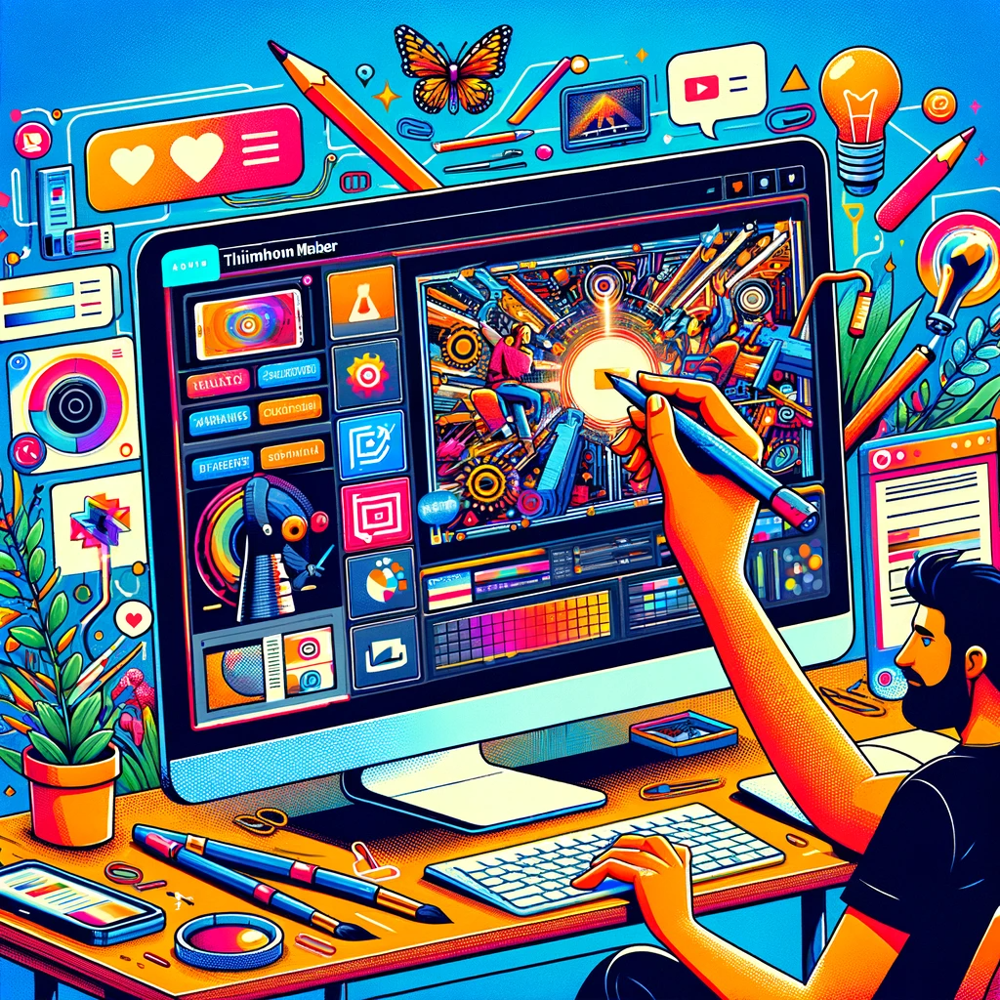

# Thumbnail Maker: Simplifying Professional Thumbnail Creation

## Summary:
Thumbnail Maker is an online tool designed to simplify the process of creating engaging and professional thumbnails for various digital platforms. It's tailored for content creators, marketers, and anyone looking for an easy way to produce eye-catching thumbnails to enhance their online presence.

## Key Points:
- User-friendly interface for easy thumbnail creation.
- Wide range of customizable templates.
- Suitable for YouTube, social media, and other digital platforms.

## Pros and Cons:

| Pros                                        | Cons                                     |
|---------------------------------------------|------------------------------------------|
| Easy to use, no design skills required      | Limited features in the free version     |
| High-quality, professional-looking results  | May not offer as much flexibility as professional software |
| Quick production of thumbnails              | Templates may be used by multiple users, reducing uniqueness |

## 🌟 Tips for the Reader:
- 🖼️ Experiment with different layouts to see what attracts more engagement.
- 🎨 Play with colors and fonts to match your brand identity.
- 💡 Keep the design simple and focused for maximum impact.

## Examples:

### Example 1: YouTube Video Thumbnail
- **Prompt:** Engaging YouTube Thumbnail
- **Input:** Title of the video and branding elements.
- **Output:** A visually appealing thumbnail that captures the essence of the video.

### Example 2: Social Media Post Thumbnail
- **Prompt:** Eye-Catching Social Media Graphic
- **Input:** Brief description of the post content.
- **Output:** A thumbnail that stands out in social media feeds.

👉 [**Try for yourself**](https://www.visme.co/thumbnail-maker/)

## URL Address of the AI Topic / vendor:
- [Thumbnail Maker - Visme](https://www.visme.co/thumbnail-maker/)

---

**Follow our Social Media for more information:**
- 📘 <a href="https://www.facebook.com/groups/trionxai" target="_blank">FB group: Trionx AI Group</a>
- 👍 <a href="https://www.facebook.com/ai.trionxai" target="_blank">FB page: Trionx AI Page</a>
- 📸 <a href="https://www.instagram.com/trionxai/" target="_blank">Instagram: Trionx AI Instagram</a>
- ▶️ <a href="https://www.youtube.com/@robotdocs/" target="_blank">Youtube: Trionx AI YouTube</a>

---

## SEO High Ranking Page Tags:
Thumbnail Maker, digital content, online thumbnail creation, visual design, social media graphics, YouTube thumbnails, graphic design tool, easy thumbnail editor, Visme, content marketing, visual appeal, brand identity, design templates, content creation, online marketing, video thumbnails, eye-catching graphics, digital marketing tools, creative thumbnails, engaging designs

