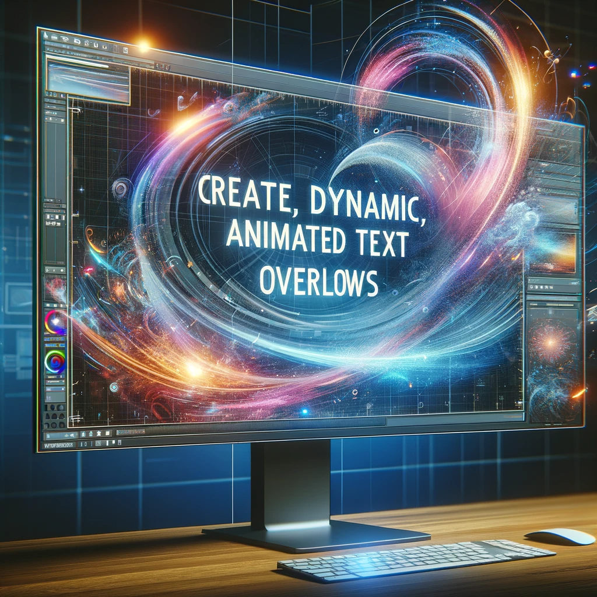
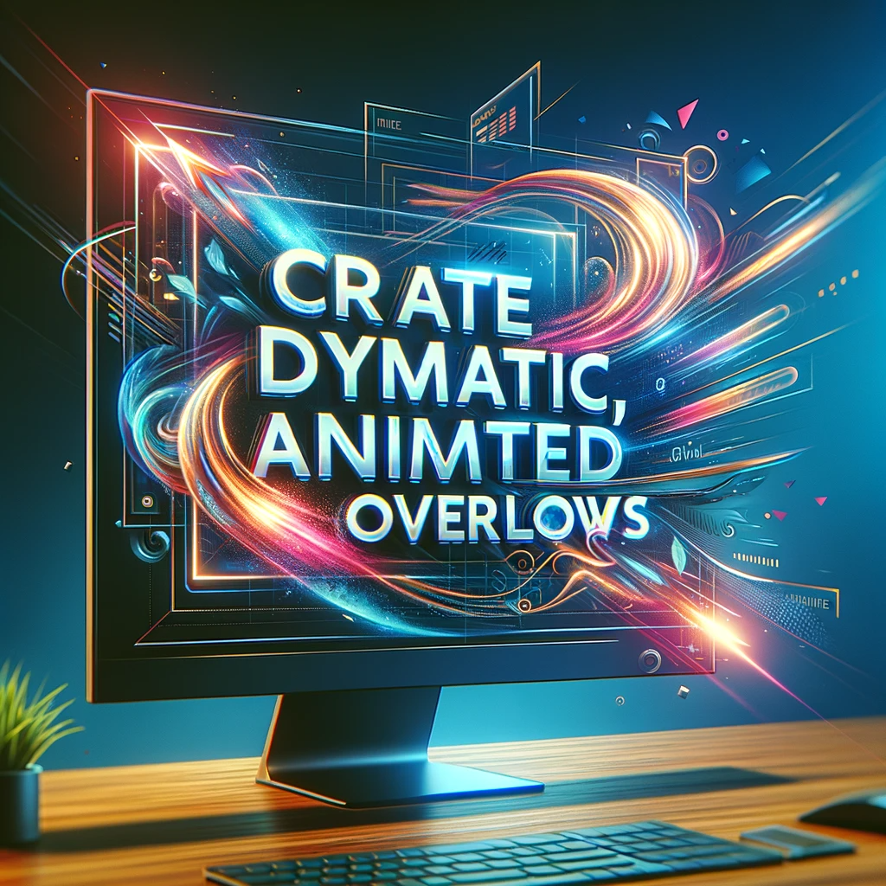

# VEED.IO: Elevating Video Editing with AI

## Summary
VEED.IO is an innovative online video editing platform that leverages AI technology to simplify and enhance video editing and production. It offers a range of tools and features that cater to both beginners and professionals.

## Key Points
- AI-driven video editing platform
- User-friendly interface
- Features for subtitles, animations, and more
- Cloud-based, no software installation needed

## Pros and Cons

| Pros                           | Cons                               |
|--------------------------------|------------------------------------|
| Intuitive interface            | Limited advanced editing features  |
| No software installation       | Free version with watermarks       |
| AI tools for quick editing     | Internet dependency for access     |
| Wide range of editing features | Subscription required for full access |

## Examples

**Example 1: Automated Subtitles**
- **Input:** Upload a video file
- **Output:** VEED.IO automatically generates subtitles.

**Example 2: Animated Text Overlays**
- **Input:** Adding text to a video
- **Output:** Create dynamic, animated text overlays.

👉 [**Try VEED.IO for yourself**](https://www.veed.io/)

## URL Address of the AI Topic / Vendor
[VEED.IO Official Site](https://www.veed.io/)

## Follow our Social Media for more information
- 📘 <a href="https://www.facebook.com/groups/trionxai" target="_blank">FB group: Trionx AI Group</a>
- 👍 <a href="https://www.facebook.com/ai.trionxai" target="_blank">FB page: Trionx AI Page</a>
- 📸 <a href="https://www.instagram.com/trionxai/" target="_blank">Instagram: Trionx AI Instagram</a>
- ▶️ <a href="https://www.youtube.com/@robotdocs/" target="_blank">Youtube: Trionx AI YouTube</a>

---

## Quiz Questions

1. What is the primary function of VEED.IO?
   - a) Music production
   - b) AI video editing
   - c) Graphic design
   - d) Web development

   **Answer:** b) AI video editing

2. How does VEED.IO handle subtitles?
   - a) Manual entry only
   - b) AI-driven automatic subtitles
   - c) Does not support subtitles
   - d) Third-party plugins required

   **Answer:** b) AI-driven automatic subtitles

3. What is a unique feature of VEED.IO?
   - a) Offline editing
   - b) Cloud-based storage
   - c) Physical DVD burning
   - d) VR content creation

   **Answer:** b) Cloud-based storage

4. What is required for full access to VEED.IO's features?
   - a) A graphics card
   - b) A VR headset
   - c) A subscription
   - d) Specialized hardware

   **Answer:** c) A subscription

5. Which user group is VEED.IO best suited for?
   - a) Advanced film directors
   - b) AI researchers
   - c) Professional photographers
   - d) Both beginners and professionals
   
   **Answer:** d) Both beginners and professionals

## SEO High Ranking Page Tags
VEED.IO, Video Editing, AI Video Editor, Online Video Editor, Cloud-Based Editing, Automated Subtitles, Video Production, Creative Video Tools, Editing for Beginners, Professional Video Editing, Video Animation, AI Transcription, User-Friendly Editor, Video Editing Software, Social Media Videos, Marketing Video Creation, Digital Content Editing, Video Editing Platform, Innovative Video Tools, AI in Video Production

