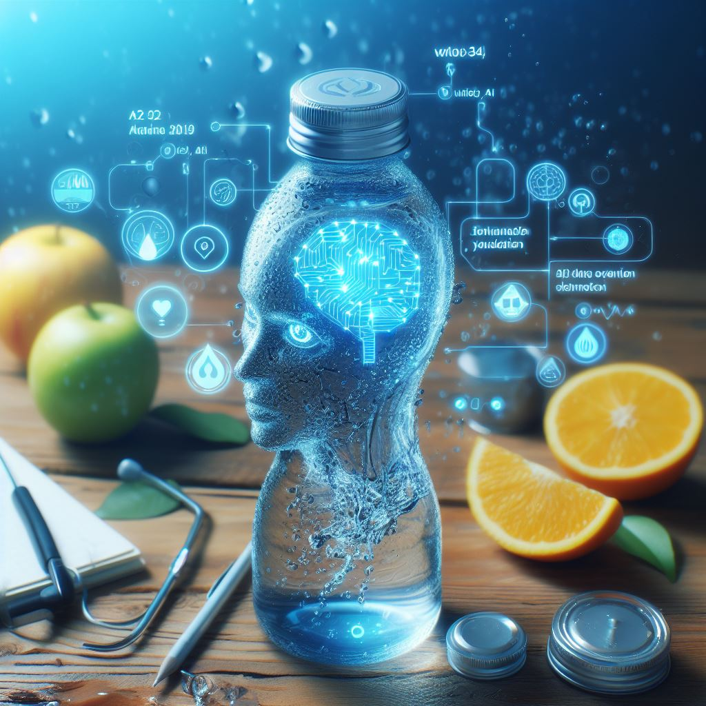

## Water: Staying Hydrated with Smart AI-Powered Reminders

### Summary:
Water, accessible at drinkwater.ai, introduces an innovative approach to staying hydrated by leveraging AI-powered reminders and insights. This platform is designed to encourage and track hydration levels, ensuring users meet their daily water intake goals for improved health and well-being.



### Key Points:
- **AI-Powered Hydration Reminders:** Water utilizes AI algorithms to provide timely reminders personalized to individual hydration needs, promoting a healthier lifestyle.
- **Goal-Oriented Hydration Tracking:** The platform allows users to set hydration goals and tracks water intake, providing insights into their daily consumption patterns.
- **Health Benefits:** By encouraging adequate hydration, Water aims to enhance overall health, boost energy levels, and support cognitive function.

### Pros and Cons:

| Pros                            | Cons                                      |
|---------------------------------|-------------------------------------------|
| Personalized hydration reminders| Initial adjustment to regular reminders  |
| Goal-oriented tracking          | Dependency on user input accuracy         |
| Health benefits of hydration    | Continuous monitoring for optimal reminders |

### Tips for the Reader 🌀:
To make the most of Water, customize your hydration goals and adhere to the reminders. Consistency in inputting water intake levels is key for accurate tracking and achieving optimal health benefits.

### Examples:

#### Example 1: Personalized Hydration Reminder
**Prompt:**
```dart
"Remind me to drink water every hour between 9 AM to 5 PM"
```
**Input:**
```
"Remind me to drink water every hour between 9 AM to 5 PM"
```
**Output:**
```
[Water providing personalized reminders to drink water every hour based on the prompt]
```

#### Example 2: Goal Tracking and Insights
**Prompt:**
```dart
"Track my daily water intake and provide insights on hydration patterns"
```
**Input:**
```
"Track my daily water intake and provide insights on hydration patterns"
```
**Output:**
```
[Water tracking daily water intake and offering insights on hydration patterns based on the prompt]
```

👉 <a href="https://drinkwater.ai/" target="_blank">Try for yourself</a>

### URL Address of the AI Topic / Vendor
<a href="https://drinkwater.ai/" target="_blank">Water</a>

Follow our Social Media for more information:
- 📘 <a href="https://www.facebook.com/groups/trionxai" target="_blank">Facebook Group</a>
- 📄 <a href="https://www.facebook.com/ai.trionxai" target="_blank">Facebook Page</a>
- 📸 <a href="https://www.instagram.com/trionxai/" target="_blank">Instagram</a>
- 🎥 <a href="https://www.youtube.com/@robotdocs/" target="_blank">YouTube</a>

<hr>

### SEO Tags:
AI, Water, Hydration Reminders, AI-Powered Insights, Goal-Oriented Tracking, Health Benefits, AI Technology, Daily Water Intake, Hydration Patterns, Reminders for Health, Personalized Wellness, Improved Lifestyle, Hydration Management, Health and Well-being.