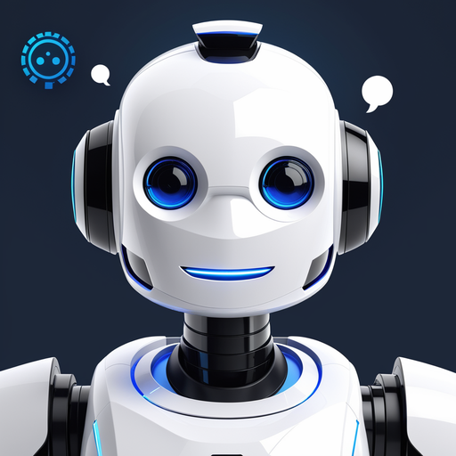
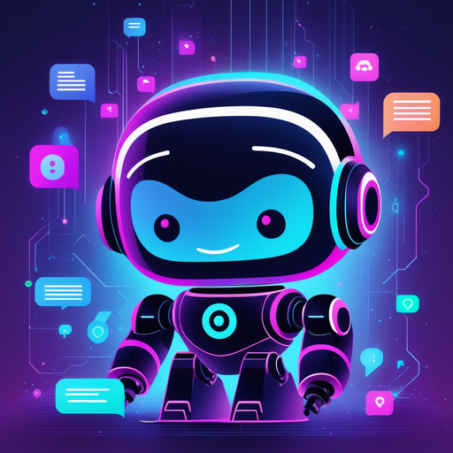

# Wisebot: Intelligent AI Solutions for Interactive Engagement

## Summary
Wisebot is an advanced AI-driven platform that offers interactive and intelligent solutions to enhance user engagement and communication. With a focus on versatility and adaptability, Wisebot is designed to cater to various industries, providing customized interactions that improve user experience and business efficiency.

## Key Points
- Advanced AI-Driven Interactive Solutions
- Enhanced User Engagement and Communication
- Customizable Interactions for Various Industries

## Pros and Cons of Wisebot
| Pros | Cons |
|------|------|
| Versatile and Customizable | Requires Regular Updates for Optimal Performance |
| Improved User Experience | Learning Curve for New Users |
| Efficient and Intelligent Engagement | Dependence on Internet Connectivity |

## Tips for the Reader 🤖💬
- Utilize Wisebot to streamline and enhance user interactions. 🌟
- Customize the AI settings to match your specific industry needs. 🛠️
- Stay updated with the latest AI trends to fully exploit Wisebot's capabilities. 🔍

🔹 Embrace AI to improve engagement, but maintain a balance with human touch.
🔹 Use Wisebot's analytics to understand user behavior and preferences.
🔹 Keep exploring new ways to integrate Wisebot into your communication strategies.

## Examples
### Example 1: Enhancing Customer Service - Wisebot
**Input**: 
"How can we improve our online customer service?"

**Output**: 
"Implement Wisebot to provide quick, AI-powered responses and improve customer satisfaction."

### Example 2: Streamlining Business Communications - Wisebot
**Input**: 
"Optimize our business communication channels."

**Output**: 
"Wisebot can be integrated across platforms to ensure consistent and efficient communication."

👉 **[Try for yourself](https://wizebot.tv/en/index){:target="_blank" rel="noopener"}**

## URL Address of the AI Topic / Vendor
[Wisebot Official Website](https://wizebot.tv/en/index)

## Follow Our Social Media for More Information
- 📘 **[Facebook Group](https://www.facebook.com/groups/trionxai){:target="_blank"}**
- 👍 **[Facebook Page](https://www.facebook.com/ai.trionxai){:target="_blank"}**
- 📸 **[Instagram](https://www.instagram.com/trionxai/){:target="_blank"}**
- ▶️ **[Youtube](https://www.youtube.com/@robotdocs/){:target="_blank"}**

### SEO Tags
Wisebot, AI Solutions, Interactive Engagement, User Experience, Business Efficiency, AI-Driven Solutions, Customizable AI, User Engagement, AI Communication, Intelligent Engagement, Customer Service AI, Business Communication, Industry Adaptability, Communication Strategies, AI Trends, Customer Satisfaction, Online Communication, AI Analytics, User Behavior, Communication Platforms

